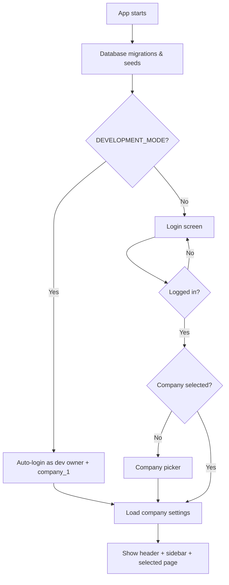

# ERP Architecture Handoff

**Purpose:** Single reference for what this app is, what it can do today, how it is built, and what comes next.  
**Audience:** Product owner / non-coder (technical details kept minimal).  
**Snapshot date:** June 3, 2026 (updated after Phase 14D-B2a)  
**Project folder:** `/Users/shoaib/Documents/streamlit_accounting_erp`  
**Related docs:** [ROADMAP.md](./ROADMAP.md) · [PHASE_18_DESIGN_REVIEW.md](../PHASE_18_DESIGN_REVIEW.md)

---

## 1. What this product is

A **multi-company accounting ERP** for small businesses:

- Restaurants  
- Tourism companies  
- Service businesses  
- Retail businesses  

It records **sales, expenses, purchases, banking, partners, and full double-entry accounting** (journal entries, general ledger, trial balance, financial reports). It is built to keep **accounting integrity**: debits must equal credits, closed periods are protected, voids create reversing entries, and changes are logged.

**How you run it (for reference):**

```bash
cd streamlit_accounting_erp
pip install -r requirements.txt
streamlit run app.py
```

The database file is **`erp_data.db`** (SQLite), stored next to the app.

---

## 2. Technology in plain English

| Piece | What it does |
|-------|----------------|
| **Python** | Programming language for all business logic |
| **Streamlit** | Web UI — sidebar menu, forms, tables, buttons |
| **SQLAlchemy** | Talks to the database using Python “models” |
| **SQLite** | Database file on disk (PostgreSQL planned later for SaaS) |
| **Pandas / OpenPyXL / ReportLab** | Excel exports and PDF invoices, receipts, statements |

### File layout (what each file is)

| File | Role |
|------|------|
| **`app.py`** | **Main application** (~15,000 lines). UI pages, posting logic, migrations, auth, backup, almost everything |
| **`models.py`** | **Database table definitions** (Company, Sale, Journal Entry, etc.) |
| **`db.py`** | Database connection setup |
| **`exports.py`** | PDF/Excel generation helpers |
| **`erp_data.db`** | Live data |
| **`backups/`** | Automatic and manual database backups |
| **`uploads/`** | Attachment files |
| **`registry/`** | Settings & module metadata catalog (Phase 14D-B2a) |
| **`ROADMAP.md`** | Detailed phase plan — what’s done and what’s next |
| **`tests/`** | Automated checks (**210 tests passing**) |
| **`settings.json.migrated`** | Old settings file; settings now live in the database |

> **Important:** Almost all logic lives in one large `app.py`. That is normal for how this project grew, but future phases should gradually split services (settings, posting, company) without changing behavior.

---

## 3. How the app starts (user journey)



### Development mode (current)

- **`DEVELOPMENT_MODE = True`** in `app.py` (line ~81).  
- Skips login and auto-selects **company_1** as **owner**.  
- **Must be turned off** before real production use.  
- Auth code still exists and works when development mode is off.

---

## 4. Multi-company architecture (Phase 14 — done)

### Design choice (frozen)

- **One database, one schema, many companies**  
- Each business row has **`company_id`**  
- Companies do **not** share data  

### Main concepts

| Concept | Meaning |
|---------|---------|
| **Company** | A business (name, slug, email, phone, legal name, etc.) |
| **CompanyUser** | A user’s membership in a company with a **role** (owner, manager, cashier, partner, viewer) |
| **Active company** | The company you are working in right now (stored in browser session) |
| **`company_1`** | Default company created from your original single-company data |

### Session keys (while using the app)

- `active_company_id` — which company is open  
- `active_company_role` — your role **in that company**  
- `active_company_name` — display name in header  

### Data isolation (Phase 14C — done)

- **`cq(session, Model)`** — all business queries filter by active company  
- **`before_flush`** — new records automatically get the active `company_id`  
- Tests verify Company A cannot see Company B’s data  

### Company settings (Phase 14D-B — done)

Settings are **per company**, not global:

| Stored in | Examples |
|-----------|----------|
| **Company table** | Name, email, phone, full legal name |
| **CompanySetting table** | Currency, tax rate, financial year, address, tax number, logo URL |
| **AppSetting table** | Global startup defaults; user preferences (`user_pref_*`) |

When a company is active, **`load_settings()` / `save_settings()`** read and write company data only.

---

## 5. What the app can do today (modules)

### Daily operations

| Menu area | What it does |
|-----------|----------------|
| **Dashboard (Home)** | KPIs, summaries, alerts |
| **New Transaction** | Quick entry hub |
| **Sales** | Cash, card, credit sales; invoices/receipts PDF |
| **Expenses** | Operating expenses, salaries |
| **Recurring Expenses** | Templates and due drafts |
| **Purchases** | Supplier purchases |
| **Cash Reconciliation** | Daily cash count vs books; approval workflow |
| **End-of-Day Close** | Daily management close with snapshots |

### Customers & vendors

| Module | What it does |
|--------|----------------|
| **Customers** | Customer master data |
| **Vendors** | Supplier master data |
| **Receivables** | Money customers owe you |
| **Payables** | Money you owe suppliers |

### Inventory & banking

| Module | What it does |
|--------|----------------|
| **Inventory** | Products, stock movements |
| **Banking** | Bank accounts, deposits, withdrawals, transfers |

### Accounting

| Module | What it does |
|--------|----------------|
| **General Ledger** | Account activity |
| **Trial Balance** | Debit/credit totals (must balance) |
| **Journal Entries** | Manual double-entry postings |
| **Fiscal Periods** | Month/period close |
| **Year-End Close** | Year lock + validation (no auto closing JE) |
| **Budget** | Monthly budget targets |
| **Chart of Accounts** | Account list |
| **Recon Health** | Reconciliation status overview |
| **Partner Accounts** | Owners/partners, movements, profit allocation |
| **Opening Balances** | Starting balances setup |

### Administration

| Module | What it does |
|--------|----------------|
| **Company Setup** | Profile + money settings (simplified labels) |
| **Users** | User accounts (owner) |
| **Audit Log** | Who did what |
| **Backup & Restore** | DB + uploads zip; optional cloud folder |
| **My Account** | Profile, preferences, notifications (header menu) |

### Reports

Profit & Loss, Balance Sheet, Cash Flow, aging, and related exports (via **Reports** page).

### Other built-in behavior

- **Attachments** on entities (files in `uploads/`)  
- **Void / reverse** pattern for transactions  
- **Audit log** on important actions  
- **Auto-backup** every 24 hours  
- **FX fields** on some transactions (currency, rate, native amount) — foundation only, not full multi-currency module  

---

## 6. Accounting rules (how money stays correct)

### Double-entry

Every financial event posts through **`create_journal_entry`**:

1. Each line is debit or credit on a chart account  
2. **Total debits must equal total credits** (within 1 cent)  
3. Posting to **closed fiscal periods** is blocked (except period-close entries)  
4. Account balances update from journal lines  

### Voiding

Voiding does **not** delete history. It:

1. Creates a **reversing journal entry**  
2. Marks the record void with reason and date  
3. Writes an **audit log** entry  

### Closes

| Close type | Purpose |
|------------|---------|
| **Cash reconciliation** | Physical cash vs GL cash account |
| **End-of-day** | Daily operational summary |
| **Fiscal period** | Accounting period lock |
| **Year-end** | Year lock + checks (allocations, periods, retained earnings snapshot) |

---

## 7. User roles

| Role | Typical use |
|------|-------------|
| **owner** | Full access, settings, users, year-end |
| **manager** | Operations + accounting, approve cash recon |
| **cashier** | Sales, expenses, daily cash, limited reports |
| **partner** | Read-focused + partner accounts |
| **viewer** | Reports only |

**Permissions** for actions (post, void, approve, etc.) use **`active_company_role`** via `_can()`.

### Navigation (fixed)

Sidebar menu now uses **`active_company_role`** (your role in the active company), not the global `User.role`.

---

## 8. Settings registry (Phase 14D-B2a — done)

Central catalog lives in **`registry/`**. The app still uses **`load_settings()` / `save_settings()`** for UI today; new code should prefer **`get_setting()`** from `registry.service`.

### Registry helpers

| Function | Purpose |
|----------|---------|
| `get_setting(session, key, company_id=…)` | Read one setting via metadata → DB |
| `get_effective_config(session, company_id)` | Support snapshot: all company settings + module states |
| `get_module_state(module_id, company_id=…)` | Hidden/disabled/locked concepts (defaults for now) |
| `evaluate_lock(key, milestones=…)` | Lock metadata check — **not enforced on save yet** |

Registry is **validated at app startup** (`validate_on_load()` in `app.py`).

### Live keys (registry → storage)

| Registry key | UI / legacy key | Where stored |
|--------------|-----------------|--------------|
| `company.display_name` | `company_name` | Company.name |
| `company.legal_name` | — | Company.full_name |
| `company.email` | `company_email` | Company.email |
| `company.phone` | `company_phone` | Company.phone |
| `company.address` | `company_address` | CompanySetting |
| `company.tax_number` | `company_tax_number` | CompanySetting |
| `company.logo_url` | `company_logo_url` | CompanySetting |
| `accounting.base_currency` | `currency` | CompanySetting |
| `accounting.default_tax_rate` | `tax_rate` | CompanySetting |
| `accounting.fiscal_year_label` | `financial_year` | CompanySetting |

### Metadata-only keys (defaults in registry; storage later)

`company.timezone`, `accounting.fiscal_year_start_month`, `accounting.multi_currency_enabled`, `accounting.coa_template`, all **`policy.*`**, most **`user.*`**.

### Lock rules (enforced on Company Settings save — 14D-B2b)

| Key | Lock |
|-----|------|
| `accounting.base_currency` | Block after first posted transaction |
| `accounting.fiscal_year_start_month` | Block after first posted transaction |
| `accounting.multi_currency_enabled` | Block disable after first FX transaction |
| `policy.vat_enabled` | Block disable after first tax invoice |

### Module state vocabulary (approved)

| State | Meaning |
|-------|---------|
| **Hidden** | Sidebar/navigation preference only |
| **Disabled** | Functionality blocked |
| **Locked** | Frozen after use / data protection |

### Still not built

| Idea | Phase |
|------|-------|
| Workspace UI / favorites | After 14D-D |
| Policy enforcement in posting | 14D-B2b+ |
| Industry presets | 14D-D+ |
| Subscription entitlements | Phase 22 |

---

## 9. Chart of accounts — per company ✅

- **`seed_chart_of_accounts_for_company()`** in `registry/coa_seed.py`  
- **`seed_default_categories_for_company()`** in `registry/categories_seed.py`  
- **`company_1`** backfilled on startup without duplicating accounts  
- **New companies** (picker → Create) get full COA + categories automatically  
- Same account **codes** can exist in different companies (isolated by `company_id`)

---

## 10. Phase history (completed)

| Phase | Topic | Status |
|-------|--------|--------|
| 1–13 | Core ERP (sales, GL, reports, partners, EOD, backup, etc.) | ✅ Done |
| 14A | Multi-company models + `company_id` backfill | ✅ Done |
| 14B | Company context, picker, login flow | ✅ Done |
| 14C | `cq()`, auto-stamp, isolation tests | ✅ Done |
| 14D-A | Company identity fields, `invited_by_id` | ✅ Done |
| 14D-B | Company-scoped settings (`load_settings` / `save_settings`) | ✅ Done |
| 14D-B2a | Settings & module registry foundation (`registry/`) | ✅ Done |
| 14D-C | COA & categories per company | ✅ Done |
| 14D-D | Company creation + picker UI | ✅ Done |

**Test status:** **210/210 passing**

---

## 11. Roadmap — what’s next

**Full detail:** see **[ROADMAP.md](./ROADMAP.md)**.

### Immediate next steps (Phase 14D)

| Phase | Topic | Status |
|-------|--------|--------|
| **14D-E** | Member management + last-owner guard | 🔜 Next |
| **14D-F** | Member roster polish | Planned |
| **14D-G** | Setup wizard v1 | Planned |

### Later phases

15 Localization · 16 UI audit · 17 Foreign currency · 18 Bank/CC import · 19 VAT · 20 Inventory depth · 21 PostgreSQL/SaaS · 22 Billing · 23 Email invites · 24 Industry modules

### ARCHITECTURE-PROTECTION-01 (active now)

**Service-first development rule** — effective immediately for all new work:

1. Models → 2. Services → 3. Tests → 4. Minimal Streamlit UI (optional)

- Business and accounting logic must live **outside** `app.py`, in reusable services.
- Tests are authoritative.
- **Pause** before building deeply in Streamlit: login/auth, staff portal, mobile uploads, permission dashboards, approval inboxes, advanced admin UI.
- **Build now in services:** accounting, reports, Daily Sales Close, Recipe Costing, data models, tests.

Full detail: [ROADMAP.md § ARCHITECTURE-PROTECTION-01](./ROADMAP.md#architecture-protection-01--service-first-development-rule).

### VENDOR-NEUTRAL-01 (active now)

**Vendor-neutral architecture rule** — effective immediately:

- Core models, services, enums, and roadmap requirements must **not** name or branch on specific POS/restaurant vendors.
- External systems use a **generic source pattern**: free-text `source_name`, optional category `source_type` (`POS`, `ERP`, `MANUAL`, `Z_REPORT`, `EXCEL_UPLOAD`, `OTHER`), optional `branch_location`.
- Vendor product names (e.g. Suitable, Wolvox) are **documentation examples only** — never enums, settings keys, or `if vendor` logic in core code.
- “POS Settlement” in banking = card-clearing workflow, not a named POS product.
- Future vendor imports = optional adapters outside core (see [DAILY-SALES-CLOSE-01](./docs/DAILY_SALES_CLOSE_01_SPEC.md)).

Full detail: [ROADMAP.md § VENDOR-NEUTRAL-01](./ROADMAP.md#vendor-neutral-01--vendor-neutral-architecture-rule). Works with [ARCHITECTURE-PROTECTION-01](#architecture-protection-01-active-now), [MIGRATION-READINESS-01](#migration-readiness-01-fastapireact-ready-service-checklist), and [FUTURE-MIGRATION-01](#future-architecture-long-term--not-active).

### MIGRATION-READINESS-01 (active now)

**FastAPI/React-ready service checklist** — effective immediately for all new `services/` modules:

- Explicit `company_id` / `user_id` inputs — no Streamlit session state in services
- Serializable DTOs at the public boundary (`to_dict()`)
- Pure `validate_*` / `compute_*` separated from persistence
- Tests without Streamlit; contract scans for posting and vendor neutrality
- Log known debt in [TECH_DEBT_AND_MIGRATION_CLEANUP.md](./docs/TECH_DEBT_AND_MIGRATION_CLEANUP.md)

**Exemplar:** DSC-P1 — `services/daily_sales_close.py`; DSC-P2 — `ui/external_sales_verification.py`; RC-P1 — `services/recipe_costing.py`; RC-P1b — `ui/recipe_costing.py`; RC-P2A — menu profitability in `services/recipe_costing.py` + `render_recipe_menu_items`; UA-P1 — `services/user_access.py`; SC-P1 — `services/staff_capture.py`; SC-P1b — `ui/staff_capture.py`. Full detail: [ROADMAP.md § MIGRATION-READINESS-01](./ROADMAP.md#migration-readiness-01--fastapireact-ready-service-checklist).

### DAILY-SALES-CLOSE-01 (implementation status)

| Phase | Status |
|-------|--------|
| DSC-P1 | ✅ Complete — model + service + tests |
| DSC-P2 | ✅ Complete — `ui/external_sales_verification.py` · Closings nav · UI contract tests |
| DSC-P3 | 📋 Pending — attachments + EOD hook + export |
| DSC-P4 | 📋 Pending — optional import adapters |

Spec: [DAILY_SALES_CLOSE_01_SPEC.md](./docs/DAILY_SALES_CLOSE_01_SPEC.md).

### RECIPE-COSTING-01 (implementation status)

| Phase | Status |
|-------|--------|
| RC-P1 | ✅ Complete — `Ingredient` / `Recipe` / `RecipeLine` · `services/recipe_costing.py` · tests |
| RC-P1b | ✅ Complete — `ui/recipe_costing.py` · Recipe Costing nav · list/read APIs · UI contract tests |
| RC-P2A | ✅ Complete — `MenuItem` / `MenuPriceHistory` · menu profitability service · Menu Items UI |
| RC-P2B | 📋 Pending — advanced analytics (menu engineering matrix · sales volume · dashboard charts) |
| RC-P3 | 📋 Pending — export · purchase integration · design spec |
| RC-AI-01 | 🔮 Future / Optional — AI recipe suggestions only; never auto-save; human confirm before `save_recipe` |

**RC-AI-01 gates:** RC-P1 · RC-P1b · RC-P2A complete · stable ingredient catalog · architecture review · explicit human approval before save wiring. Detail: [ROADMAP.md § RC-AI-01](./ROADMAP.md#rc-ai-01--ai-recipe-suggestions-future--optional).

Tech debt: [TECH_DEBT_AND_MIGRATION_CLEANUP.md](./docs/TECH_DEBT_AND_MIGRATION_CLEANUP.md) (TD-RC-*).

### USER-ACCESS-01 (implementation status)

| Phase | Status |
|-------|--------|
| UA-P1 | ✅ Complete — `UserPermissionOverride` · `services/user_access.py` · `_can()` resolver swap · tests |
| UA-P1b | 📋 Pending — owner permission management UI |

**UA-P1 smoke audit (2026-06-13):**
- Owner compatibility passed
- Manager compatibility passed
- Viewer compatibility passed
- 0 permission regressions
- 0 hidden page regressions
- 0 access regressions
- `manage_permissions` is an intentional owner-only addition (not a regression)

Spec: [USER_ACCESS_STAFF_CAPTURE_SPEC.md](./docs/USER_ACCESS_STAFF_CAPTURE_SPEC.md). Tech debt: [TECH_DEBT_AND_MIGRATION_CLEANUP.md](./docs/TECH_DEBT_AND_MIGRATION_CLEANUP.md) (TD-UA-*).

### STAFF-CAPTURE-01 (implementation status)

| Phase | Status |
|-------|--------|
| SC-P1 | ✅ Complete — `ExpenseDraft` · `DraftAttachment` · `services/staff_capture.py` · injected `post_fn` approval · tests |
| SC-P1b | ✅ Complete — `ui/staff_capture.py` · submit/receipts/inbox · `NAV_STAFF_EXPENSE_CAPTURE` · posting seam · UI contract tests. No portal gate. |
| SC-P2 | 📋 Pending — `sales_total_drafts` · `salary_drafts` · `cash_count_drafts` |
| SC-P3 | 📋 Pending — returned-flow polish · submission feed · retention/archive · OBS-01 review |

Host `pytest tests/` — **1551 passed, 2 xfailed**.

Spec: [USER_ACCESS_STAFF_CAPTURE_SPEC.md](./docs/USER_ACCESS_STAFF_CAPTURE_SPEC.md). Tech debt: [TECH_DEBT_AND_MIGRATION_CLEANUP.md](./docs/TECH_DEBT_AND_MIGRATION_CLEANUP.md) (TD-SC-*).

### Future Architecture (long-term — not active)

**FUTURE-MIGRATION-01** — Approved long-term direction: React frontend → FastAPI → service layer → SQLAlchemy → PostgreSQL. Streamlit + SQLite remain the current platform; migration is incremental and gated on pre-migration requirements (Daily Sales Close, Recipe Costing, User Access, Staff Capture, date system stabilization, service-layer extraction). Full detail: [ROADMAP.md § Future Architecture / Long-Term Roadmap](./ROADMAP.md#future-architecture--long-term-roadmap).

**FUTURE-MIGRATION-AUDIT-01** — Recorded 2026-06-13 (Claude independent review). **Migration readiness score: 62/100.** New `services/` modules (DSC, RC, UA, SC) are FastAPI-ready per MIGRATION-READINESS-01. **Main blocker:** `app.py` posting engine (`create_journal_entry`, `post_*`, void/reversal). **Keystone next migration task:** [POSTING-SERVICE-01](./ROADMAP.md#posting-service-01--keystone-migration-task). Also tracked: MONEY-DECIMAL-01 · ALEMBIC-01 · BANKING-SERVICE-01 · REPORTS-SERVICE-01 · CONTEXT-AUDIT-01. Register: [TECH_DEBT § FUTURE-MIGRATION-AUDIT-01](./docs/TECH_DEBT_AND_MIGRATION_CLEANUP.md#future-migration-audit-01-2026-06-13). Audit does **not** authorize FastAPI/React build start.

### Order (frozen)

```
14D-B2a ✅ → 14D-C ✅ → 14D-D ✅ → 14D-E → 14D-F → 14D-G → Phase 15+
```

---

## 12. Future bank reconciliation (summary)

Full design is in **`PHASE_18_DESIGN_REVIEW.md`**. Core rules:

- **Three pipelines:** bank statements, credit card statements, card settlements  
- **No automatic posting** — user reviews everything  
- **Needs Review queue** for uncertain rows  
- **Credit card = liability account**; card sales clearing architecture approved  
- Start with **CSV/Excel** imports; PDF later  

---

## 13. Risks and simplifications (honest list)

| Risk | Why it matters |
|------|----------------|
| **Monolithic `app.py`** | Hard to maintain; any change can affect unrelated areas |
| **`app.py` posting engine** | **Main FastAPI migration blocker** (FUTURE-MIGRATION-AUDIT-01, 62/100) — GL posting not yet in `services/`; keystone: POSTING-SERVICE-01 |
| **COA not per company yet** | ✅ Resolved in 14D-C |
| ~~**Nav role vs company role**~~ | ✅ Fixed |
| **DEVELOPMENT_MODE on** | Easy to forget before go-live |
| **Lock rules on save** | `set_setting()` / `save_company_settings_batch()` + `get_company_milestones()` (14D-B2b) |
| **`financial_year` is a year label** | Registry adds `accounting.fiscal_year_start_month` (default 1) — wire in 14D-C/D |
| **SQLite** | Fine for single-server; PostgreSQL needed for SaaS scale |
| **Feature count vs vertical polish** | Many modules; restaurant/retail need presets + inventory/VAT depth |

**Do not add** dozens of workspace toggles before registry + COA per company are done.

---

## 14. Glossary (non-coder)

| Term | Plain meaning |
|------|----------------|
| **ERP** | Software that runs business operations and accounting together |
| **GL / General Ledger** | Complete list of account movements |
| **Trial Balance** | Check that all debits equal all credits |
| **AR / Receivables** | Customers owe you |
| **AP / Payables** | You owe suppliers |
| **COA** | Chart of Accounts — list of buckets (Cash, Sales, Rent, etc.) |
| **Journal entry** | One balanced accounting record (debits + credits) |
| **Void** | Cancel a transaction properly with a reversal, not delete |
| **Fiscal period** | Accounting month/quarter you can close |
| **Migration** | One-time database upgrade step when the app starts |
| **company_id** | Tag that ties a row to one company |

---

## 15. What to tell a developer or AI assistant next

Copy-paste this when starting work:

> Project: `/Users/shoaib/Documents/streamlit_accounting_erp`  
> Read `ARCHITECTURE_HANDOFF.md` and `ROADMAP.md` first.  
> Phase **14D-D** complete. Next: **14D-E member management**.  
> Create companies from the company picker (“Create a new company”).  
> Do not enable production until `DEVELOPMENT_MODE = False`.

---

## 16. Document maintenance

| When | Update this file |
|------|------------------|
| After each phase completes | Add row to §10, adjust §11 |
| After registry ships | Replace §8 “not built yet” with registry key list |
| After 14D-C | Update §9 COA section |
| Before production | Confirm DEVELOPMENT_MODE, role nav fix, backups |

---

*Last updated after Phase 14D-C, 14D-D, nav fix, Company Setup UI pass, DAILY-SALES-CLOSE-01 DSC-P2 doc sync, RECIPE-COSTING-01 RC-P1–P2A, RC-AI-01 future spec.*
