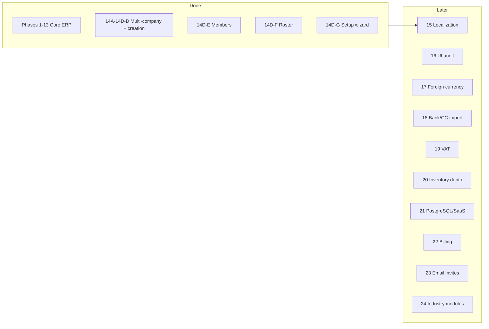

# ERP Development Roadmap

**Project:** `streamlit_accounting_erp`  
**Last updated:** June 5, 2026 (Phase A shell stabilization — header, breakpoints, People hub, Reports deep-links)  
**Companion docs:** [ARCHITECTURE_HANDOFF.md](./ARCHITECTURE_HANDOFF.md) · [PHASE_18_DESIGN_REVIEW.md](../PHASE_18_DESIGN_REVIEW.md)

This roadmap defines **what is done**, **what is active**, and **what comes next** — in order. Do not skip phases without an explicit architecture decision.

---

## Status at a glance

| Area | Status |
|------|--------|
| Core ERP & accounting engine | ✅ Complete |
| Multi-company isolation | ✅ Complete |
| Company settings isolation (14D-B) | ✅ Complete |
| Settings / module registry (14D-B2a) | ✅ Complete |
| COA & categories per company (14D-C) | ✅ Complete |
| Company creation (14D-D) | ✅ Complete |
| Sidebar uses company role (nav fix) | ✅ Complete |
| Simplified Company Setup UI | ✅ Complete (Expert policies stub) |
| Automated tests | ✅ **360 passing** (run `pytest tests/`) |
| Member management (14D-E) | ✅ Complete |
| Member roster polish (14D-F) | ✅ Complete |
| Setup wizard v1 (14D-G) | ✅ Complete |
| Localization EN/TR (15) | ✅ Complete |
| DEVELOPMENT_MODE | ⚠️ **On** in `app.py` (`DEVELOPMENT_MODE = True`) — set `False` before production |
| Shell / mobile chrome (Phase A) | ✅ Stabilized — fixed header, 968px breakpoint, People hub wired |

---

## Phase map (high level)



---

## ✅ Completed phases

### Phases 1–13 — Core ERP

Dashboard, sales, expenses, purchases, customers, vendors, banking, AR/AP, reports, GL, trial balance, P&L, balance sheet, cash flow, attachments, audit log, fiscal/year-end close, partners, profit allocation, cash reconciliation, EOD close, recurring expenses, backup/restore, opening balances.

### Phase 14A — Multi-company foundation

`Company`, `CompanyUser`, `CompanySetting`; `company_id` on business tables; default `company_1`.

### Phase 14B — Company context

Login → company picker; `active_company_id`, `active_company_role`, `active_company_name`.

### Phase 14C — Data isolation

`cq(session, Model)`; auto-stamp on flush; isolation tests.

### Phase 14D-A — Company model

`full_name`, `email`, `phone`, `created_by_user_id`; `CompanyUser.invited_by_id`.

### Phase 14D-B — Company settings isolation

`load_settings()` / `save_settings()` company-scoped; legacy `AppSetting` for global/user prefs only.

### Phase 14D-B2a — Registry foundation ✅ *just completed*

**Delivered:**

| Item | Location |
|------|----------|
| Settings catalog (keys, scope, type, lock metadata) | `registry/settings_catalog.py` |
| Module catalog (ids, nav mapping, planned flags) | `registry/modules_catalog.py` |
| Accounting mode bundles (stub) | `registry/accounting_mode_bundles.py` |
| Loader + validation | `registry/loader.py` |
| Read helpers | `registry/service.py` — `get_setting`, `get_effective_config`, `get_module_state`, `evaluate_lock` |
| Startup validation | `app.py` imports `validate_on_load()` |
| Tests | `tests/test_phase14b2_registry.py` (+16 tests) |

**Explicitly NOT in B2a:**

- Workspace / favorites UI  
- Policy enforcement in posting  
- `set_setting()` writes through registry  
- Industry presets  
- Subscription entitlements  
- `company_module` database tables  

### Phase 14D-B2b — Setting lock enforcement ✅

| Item | Location |
|------|----------|
| Milestones | `get_company_milestones()` — `first_posted_at` from min `JournalEntry.entry_date` |
| Guarded writes | `set_setting(..., check_locks=True)`, `save_company_settings_batch()` |
| Lock errors | `SettingLockError` + EN/TR `registry.lock.*` messages |
| Company Settings UI | `render_company_settings` — batch save; block on currency, warn is advisory only |
| Tests | `tests/test_phase14b2_registry.py` (milestones, block, warn+confirm) |

### Phase 14D-C — COA per company ✅

| Item | Location |
|------|----------|
| Per-company COA seed | `registry/coa_seed.py` |
| Per-company categories | `registry/categories_seed.py` |
| Startup backfill for company_1 | `_ensure_company_1_provisioned()` |
| Tests | `tests/test_phase14c_coa_per_company.py` |

### Phase 14D-D — Company creation ✅

| Item | Location |
|------|----------|
| `create_company()` | `registry/company_provision.py` |
| Picker UI | “Create a new company” expander on company picker (auto-opens when user has no company) |
| Header shortcut | Profile menu → **Create company** (any signed-in user) |
| Zero-membership login | Allowed; picker shows create-first-company flow; new company auto-activates |
| Tests | `tests/test_phase14d_company_creation.py` |

### UX pass ✅

- Sidebar menu uses **company role** (`active_company_role`)  
- **Company Setup** page: Profile + Money & books + Expert stub  

---

## 🔜 Phase 14D — Company management (remaining)

### 14D-E — Member management ✅ **DONE**

**Goal:** Owner manages `CompanyUser` for active company.

**Delivered:** Administration → **👤 Members** (and Company Settings section): add existing user, create user + add, change role, deactivate/reactivate, remove from company; per-company last-owner guard; audit log entries; `registry/company_members.py` helpers.

**Roles:** owner, manager, partner, cashier, viewer.

**Rules:**

- **`CompanyUser.role`** only for access — not `User.role`  
- **Last owner guard** — cannot remove/deactivate/demote last active owner  
- Option A invites only (no email tokens yet)

---

### 14D-F — Member roster polish ✅ **DONE**

**Delivered:** Members page **Roster** tab (search, role/status filters, paginated table, Excel/PDF export); role badge counts in company overview; last login, invited by, member since columns; **Company Setup** and legacy Settings team overview; **Add & manage** tab for 14D-E actions.

### 14D-G — Setup wizard v1 ✅ **DONE**

**Delivered:** 3-step wizard on **Company Setup** — business type → accounting mode → optional modules. Writes registry defaults to `CompanySetting` (vertical, mode, policy bundle, module toggles, `setup.wizard_completed`). Module prefs affect `get_module_state` (e.g. inventory off). Policy enforcement still deferred.

---

## Phase 15 — Localization (EN / TR) — ✅ **Complete**

**15a — Shell ✅:** Login, picker, header, sidebar nav, Company Setup, Members, wizard.

**15b — Daily ops ✅:** `_st_page_title()` on all `st.title` pages; **Home** dashboard banner/KPIs; **Sales** and **Expenses** forms/filters; **Add Transaction** header. Strings in `registry/locales/transactional.py`.

**15c — CRM slice ✅:** **Vendors**, **Purchases**, **Customers** — forms, filters, void flow, statements, manage rows. Shared `form.*` keys; `PURCHASE_TYPE_I18N` / `PURCHASE_GL_I18N`.

**15d — AR/AP + Banking ✅:** **Payables**, **Receivables**, **Banking** — forms, filters, KPIs, payments, void, CSV import header.

**15e — Reports & GL ✅:** **Reports** hub (exec + management tabs), **General Ledger**, **Trial Balance**, **P&L** / **Today's Summary** banners, sidebar date range, aging buckets, cash recon shell, shared table column headers (`_localize_df`).

**15f — Financial close ✅:** **Balance Sheet**, **Cash Flow**, full **Cash Reconciliation** (4 tabs), **End-of-Day Close**, management-report KPI labels, export popover (Excel/CSV/PDF title).

**15g — Export copy & remaining KPIs ✅:** Export section labels in P&L / BS / CF exports; EOD history detail metrics; fiscal period KPI labels; management-report growth captions and empty-state messages; `_DF_COL_I18N` extended with 8 new column headers.

**15h — Broad coverage ✅:** All major pages localized — Year-End Close, Fiscal Periods, Audit Log, Partners/Equity, Opening Balances, Add Transaction, Transaction History, Journal Entries, Recurring Expenses, Customer Ledger, Inventory, COA, Budget, Categories, Administration, Backup & Restore, My Account. ~185 new EN+TR key pairs across 18 namespaces (`yec`, `fiscal`, `audit`, `partner`, `ob`, `txn`, `je`, `recurring`, `ledger`, `inv`, `coa`, `budget`, `rpt`, `cat`, `admin`, `backup`, `myaccount`, `form` common).

**15i — Cleanup pass ✅:** A follow-up audit found ~70 hardcoded strings still slipping through in less-trafficked code paths (the earlier "0 remaining" claim was premature). Localized: attachment list/upload form, year-end-close validation success/error/warning messages and acknowledgements, Fiscal Periods action buttons & confirm warnings, Equity Movements (new-movement expander, current-account/advance labels & warnings), Add-Transaction inline errors + supplier-payment payable guards + currency/FX/notes/save-button copy, Transaction History row-button tooltips + full detail panel field labels + edit panel, Journal Entries manual-entry section, COA balance summary, Sales/Expense void sections, recurring drafts/notes, bank CSV preview/import, category & subcategory inline help/placeholders, Advanced admin expander titles + migration/flag labels, Backup & cloud-sync copy, My Account password button, and the header search box + notifications popover. **130 new EN+TR key pairs (1221 keys each side, full parity); 0 known hardcoded user-facing strings remaining. 245 tests passing (incl. 2 new 15i tests).**

---

## Phase 16 — UI / theme audit

Complete dark mode, readability, header/sidebar polish, mobile pass.  
**Plan:** [PHASE_16_AUDIT.md](./PHASE_16_AUDIT.md)

### Phase 16A — Foundation ✅

| Item | Location |
|------|----------|
| Global CSS extracted | `ui/theme.css` |
| Tokens + bootstrap | `ui/theme.py` — `bootstrap_theme()`, DB theme on each `main()` |
| Section header helper | `ui/section.py` |
| Streamlit baseline | `.streamlit/config.toml` |
| Page audit matrix | `PHASE_16_AUDIT.md` |
| Tests | `tests/test_phase16a_theme.py` |

### Phase 16B — Native widgets ✅

| Item | Location |
|------|----------|
| Widget dark/light CSS | `ui/widgets.css` (inputs, select, tabs, expander, forms, alerts, metrics, `border=True` containers) |
| Streamlit version pin | `requirements.txt` — `>=1.28,<2` |

### Phase 16C — Page sweep ✅

| Item | Location |
|------|----------|
| Page banners → `section_header_html()` | 18 blocks (audit, txn history, partner, equity, opening balances, advanced, recon, EOD, reports, members, wizard, company setup, settings) |
| Muted/section text → `var(--theme-muted)`; dark text → `var(--theme-text)` | section helpers, captions, txn party names, audit/JE diffs, neutral KPI values |

### Phase 16D — Header + responsive ✅

| Item | Location |
|------|----------|
| Header `📊 Accounting ERP · {company} · {user}` w/ truncation | `render_top_header`, `ui/theme.css` |
| Responsive KPI grid (1 col ≤640px) + mobile sidebar drawer (≤768px overlay) | `ui/theme.css` |

### Phase 16E — Pastel banners + QA ✅

| Item | Location |
|------|----------|
| Aging chips, P&L / cash-flow / balance-sheet headers, badges, Budget Styler → `color-mix` theme tints | `app.py` |
| Tests (responsive, header, no-hardcoded-pastel guards) | `tests/test_phase16a_theme.py` |

**Phase 16 complete.** Full suite green (274 tests). Remaining decorative hex (status dots, white-on-color pills, `#9ca3af` footnotes) intentionally kept. EN/TR × light/dark screenshot pass + a real ≤768px device check recommended before release.

---

## Phase 17 — Foreign currency

Base currency + optional multi-currency; FX accounts; original amount + rate + base amount; exchange transactions; FX gain/loss. Do not hardcode TRY.

---

## Phase 18 — Bank / credit card statement reconciliation

Full design: [PHASE_18_DESIGN_REVIEW.md](../PHASE_18_DESIGN_REVIEW.md) (APPROVED blueprint — CSV/Excel first, zero auto-post, Needs Review queue, Card Sales Clearing architecture, 6 new tables, rule engine, sub-phases 18A–18G).

**Decisions locked (June 4, 2026):**

- **Confirm everything.** Nothing posts to the GL without an explicit per-line user confirmation. Suggestions are advisory only; a "confirm all suggested" shortcut still requires a deliberate click. (Reinforces the doc's zero-auto-post policy.)
- **Full provenance / 6-month traceability.** Imported statements land in a staging layer that keeps the **raw line forever** (statement file name, account, import date, who imported), linked forward to the `BankTransaction` / `JournalEntry` / `Payable` / `ExpenseRecord` it produced, plus who confirmed and when. From any posted transaction you can walk back to the originating statement line; every confirm/assign/fee action writes an `AuditLog` entry.
- **Outflows allow ad-hoc.** Assigning a statement debit to a vendor can either settle an existing open `Payable` **or** create an ad-hoc expense / supplier payment on the spot (for unexpected, non-routine costs) posted to that vendor's account.
- **Single "Bank Charges" expense account** (supersedes the doc's split "Card Processing Fees" vs "Bank Charges"). Both outgoing-transfer charges and card-deposit/settlement fees post to one Bank Charges account; when a matched total doesn't tie out, the shortfall is proposed as a Bank Charges line for confirmation.
- **Feature toggles — all OFF by default, so behaviour is identical to today until enabled:**
  - `banking.reconciliation_enabled` — the whole reconciliation/matching workspace.
  - `banking.company_card_enabled` — company-owned credit card as a payment source (purchases credit a Credit Card Payable liability; paying the bill = bank→card transfer).
  - `banking.bank_charges_enabled` — the fee/charge step (country-dependent; some countries have no such charges).
  - `banking.card_settlement_enabled` — card-settlement reconciliation + the merchant settlement statement import + the Card Sales Clearing flow (not every business takes card payments or receives a settlement statement; when off, card sales behave as they do today).

**Known drift to resolve during 18A/18E:** current code posts a Card sale **directly to Bank** (the doc's *rejected* alternative) via `post_card_sale` + an immediate `BankTransaction`. The approved architecture routes card sales through a **Card Sales Clearing** account and only moves to Bank at settlement — that change is what makes batched, net-of-fee settlement matching possible.

**Three import types (settlement statement added June 4, 2026):**

1. **Bank statement** — debits/credits; shows only the *net* deposit and usually hides fees.
2. **Credit card statement** — company-card charges (liability); gated by `banking.company_card_enabled`.
3. **Merchant settlement statement** *(preferred input for card-settlement recon; gated by `banking.card_settlement_enabled`)* — itemized per batch: **gross sales, processor fee, net deposited**. The fee is read directly from this statement (exact, not inferred), it reconciles the Card Sales Clearing account, and its net figure cross-checks against the bank statement's deposit line. Fallback when a processor provides no settlement statement: infer the fee as the clearing-vs-deposit difference for user confirmation. *(Capture real column layout from a user-provided sample before building — formats vary by processor.)*

**MVP build order (trimmed from the 18A–18G blueprint — deterministic, no ML/rules yet):**

- **18-MVP-1 — Clearing migration + toggles. ✅ (June 5, 2026)** Added `banking.*` settings (all OFF = today's behaviour); added **Card Sales Clearing** (1150) + **Bank Charges** (5800) accounts and an idempotent `ensure_phase18_accounts` startup backfill; when `banking.card_settlement_enabled` is on, card-sale posting routes to clearing (`DR Card Sales Clearing / CR Sales Revenue`, no bank deposit yet) — when off, card sales post directly to Bank as today; added `is_reconciled` / `statement_ref` / `charge_subtype` to `BankTransaction`. **Deviation from the doc's automatic one-time backfill:** historical card-sale treatment is now an explicit, user-chosen setting (`banking.card_sales_clearing_backfill` = `none` | `reclassify_to_clearing`) applied only via an owner/manager "Apply migration now" button — never automatic, guarded by a per-company `MigrationFlag`, idempotent, posting through `create_journal_entry`. Settlement → Bank + Bank Charges ← clearing lands in 18-MVP-4.
- **18-MVP-2 — Import to staging + provenance. ✅ (June 5, 2026)** `BankStatementImport` + `BankStatementRow` tables; raw file on disk under `uploads/statements/` + SHA-256; `raw_line_text` per row; CSV/Excel parse with column mapping UI in Advanced → Bank Statement Import (gated by `banking.reconciliation_enabled`); soft duplicate flags on composite key (date + amount + normalized description + balance); permissions `import_bank_statement` / `view_bank_statement_import`. **No GL posting** — matching/posting is MVP-3. CC/settlement import pipelines deferred.
- **18-MVP-3 — Manual match & post (deterministic). ✅ (June 5, 2026)** Step **③ Match & post** on Bank Statement Import; deposits match card sales in clearing (multi-select, amounts must tie); other deposits post DR Bank / CR user-selected account; withdrawals assign vendor + open `Payable` **or** ad-hoc expense; confirm-everything; posts via `create_journal_entry`; `BankTransaction.statement_ref=bsr:{row_id}`; row status → `posted`; `AuditLog` on each post. Bank charges / fee shortfalls deferred to 18-MVP-4.
- **18-MVP-4 — Bank charges + settlement statement. ✅ (June 5, 2026)** Merchant settlement import (`SettlementStatementImport` / `SettlementStatementRow`) with gross/fee/net column mapping under Upload expander (gated by `banking.card_settlement_enabled`); clearing match books **Bank Charges** when deposit &lt; clearing — exact fee from linked settlement batch or inferred difference with user confirmation (gated by `banking.bank_charges_enabled`); cross-check settlement gross↔clearing and net↔deposit; `BankTransaction.charge_subtype=card_settlement_fee`; provenance link `bank_statement_rows.settlement_row_id`.
- **18-MVP-5 — Company credit card (optional). ✅ (June 5, 2026)** `BankAccount.kind="credit_card"` for bank-like UX; **Credit Card Payable** (2110) GL; expenses/purchases/payable payments by card credit the liability when `banking.company_card_enabled`; bank-statement **KK ödeme** posts DR CC Payable / CR Bank via Match & post with card-account picker.
- **Deferred to post-MVP:** rule engine, fuzzy/ML suggestions, receipt auto-matching, PDF/OCR import, advanced report suite, multi-currency conversion (store original amount/currency now, leave base = original until Phase 17 FX).

**Engineering guardrails (accepted June 4, 2026):**

- **Clearing migration is the keystone** — do it first (18-MVP-1); without it, batched settlement matching is impossible. Includes a one-time backfill of card sales currently posted straight to Bank.
- **Deterministic matching only at MVP** — group unsettled clearing entries inside the deposit's date window and let the user multi-select; no fuzzy/ML matching yet.
- **Handle refunds / chargebacks** — settlement and statement lines can be negative; the matcher and sum-checks must not assume positive-only amounts.
- **Single Bank Charges GL account, with a charge-subtype tag** (`transfer_fee` / `card_settlement_fee` / `monthly_fee`) for reporting without extra accounts.
- **Duplicate detection is soft, not a hard constraint** — composite key (date + amount + normalized description + running balance) with a "possible duplicate, confirm?" review, so legitimate repeated payments (e.g. identical monthly rent) aren't rejected. Don't depend on `bank_reference` (many CSVs lack it).
- **Provenance = real file, not just metadata** — store uploaded file bytes + SHA-256, keep every raw statement line forever, and surface a **"Source"** link on each transaction's detail panel back to its originating line.
- **Add `is_reconciled` / `statement_ref` to `BankTransaction`** so *existing* rows (e.g. card-sale deposits) can be matched, not only newly imported ones.
- **Company credit card = bank-like account (`kind="credit_card"`)** for UX reuse, but GL posts to a Credit Card Payable liability; mind the existing `BankAccount.balance` cache sign.
- **All posting routes through `create_journal_entry`** so the closed-period guard and balanced-entry enforcement always apply; never write `JournalEntry` rows directly.
- **Currency:** capture `original_amount` + `currency` from day one, but leave base = original (no conversion) until Phase 17 FX.
- **Permissions:** import + approve/post = owner/manager; cashier may review only; partner read-only reports (per design doc Part 12).

---

## Phase 18-MUX — Mobile Transaction UX *(partially shipped — stabilize only; no expansion)*

**Status:** Active (stabilization). **Prerequisite:** mobile navigation shell — **met** (header/shell fixes Jun 6, 2026). Calculator MVP shipped; focus on dual-host reliability, layout CSS, and save-path smoke tests — **no new types or accounting changes**.

**Goal:** Calculator / POS-style **New Transaction** screen on mobile (≤768px) for fast daily entry with minimal phone keyboard use. Desktop Add Transaction form stays unchanged.

**Decisions locked (June 6, 2026):**

| # | Decision |
|---|----------|
| 1 | **Mobile only** — calculator UI hidden on desktop (≥769px). |
| 2 | **Desktop form unchanged** — existing two-column `render_add_transaction` layout. |
| 3 | **New Transaction remains primary entry** — top action bar + Quick Create on Home; Sales/Expenses/Purchases list pages stay under More as history/review only. |
| 4 | **No accounting logic changes** — presentation layer only. |
| 5 | **`_at_save` remains the single save path** — mobile collects inputs, then calls existing `_at_save()`. |
| 6 | **Salary = visible chip** — maps internally to Expense → Worker → Salary (no new posting type). |
| 7 | **Categories** — searchable **bottom sheet** when lists are long; avoid a full-screen card wall at scale. |
| 8 | **Foreign currency** — keypad/display design must allow multi-currency later; FX implementation can defer (aligns with Phase 17). |
| 9 | **Do not implement until mobile nav is stable** — hubs, padding, roles, module gating verified in production use. |

**Preferred UX (summary):**

- Read-only amount display + in-app keypad (`st.button` grid, `session_state` buffer) — **no** `st.text_input` for amount on mobile (avoids OS keyboard).
- Large type chips: Sale, Expense, Purchase, Customer Payment, Supplier Payment, Salary (+ Bank Transaction optional/advanced).
- Payment method chips filtered per type (reuse existing method sets).
- Step flow: type → amount → payment → category/context → optional notes/receipt → save.
- Save button sticky above bottom nav; label shows type + formatted amount.

**Technical approach (when started):**

- Dual-host pattern: `.erp-at-mobile-host` / `.erp-at-desktop-host`; separate widget keys (`mob_at_*` vs `at_*`); CSS `@media` shows one host.
- Consider `st.fragment` for keypad to reduce rerun scope (Streamlit ≥1.33).
- Reuse `_parse_amount_str`, `_allowed`, `_can("create_transaction")`, existing conditional fields per type.

**Suggested build order (post-prerequisite):**

| Sub-phase | Scope |
|-----------|--------|
| **18-MUX-1** | Keypad + display + mobile host CSS; Sale + Cash MVP → `_at_save` |
| **18-MUX-2** | All type chips + filtered payment chips; Salary → worker Expense mapping |
| **18-MUX-3** | Searchable category bottom sheet; customer/vendor/payable context |
| **18-MUX-4** | Edge cases: Card bank account, supplier payable, worker salary sub-fields, FX display hooks |
| **18-MUX-5** | `st.fragment` polish, i18n, `UI_SHELL.md`, Playwright + unit tests for buffer/formatting |

**Explicitly deferred:** multi-line `*` entry, changes to `_at_save` / posting functions, desktop calculator UI, Phase 17 FX conversion logic.

**Reference:** Mobile nav contract in [UI_SHELL.md](./UI_SHELL.md) (mobile chrome section). Calculator mockup review in project canvases (`mobile-nav-mockups.canvas.tsx`).

---

## Phase 19 — VAT / tax

VAT enable, rates, inclusive/exclusive pricing, liability accounts, VAT reports, lock after first tax invoice.

---

## Phase 20 — Inventory integrity

Stock movements, valuation, COGS, counts, negative stock control, adjustments. Enable/disable/lock — not hide-only.

---

## Phase 21 — PostgreSQL / SaaS readiness

Review shared schema + `company_id` + RLS vs alternatives; tenant isolation tests; concurrency; impersonation audit. **Keep shared schema during dev** (frozen decision).

---

## Phase 22 — Subscription / billing

**Status:** Planned (after Phase 21 PostgreSQL / SaaS). **Will implement** — not optional.

| Area | Plan |
|------|------|
| **Trial (per company)** | On `create_company()`, start `trial` status; default **14 days** (configurable via `billing.trial_days`, e.g. 30). Store `trial_started_at`, `trial_ends_at` on `Company`. |
| **Extend trial** | Platform/owner admin sets new `trial_ends_at` or adds days; log to `AuditLog` (manual until payment gateway exists). |
| **Enforcement** | After company gate in `main()`: if `now > trial_ends_at` and status is `trial` → block with message (read-only export optional later). |
| **Paid plans** | Plans, entitlements, gateway, usage limits, `active` / `expired` / `suspended`; tie to registry `ModuleDef.entitlement` and `get_module_state`. |

**Explicitly NOT in earlier phases:** subscription tables, Stripe, trial gate (deferred here).

---

## Phase 23 — Email / invitation infrastructure

Password reset, verification, invite tokens, SMTP.

---

## Phase 24 — Advanced industry modules

Restaurant (POS, recipes), retail (barcode), services (projects), tourism (bookings). **Future only.**

---

## Module state vocabulary (frozen)

| State | Meaning |
|-------|---------|
| **Hidden** | Navigation preference — module still exists |
| **Disabled** | Functionality blocked (plan, safety, misconfiguration) |
| **Locked** | Setting/module frozen after use (e.g. base currency after first post) |

---

## Registry key quick reference

### Live today (backed by DB)

| Registry key | Legacy / storage |
|--------------|------------------|
| `company.display_name` | `Company.name` |
| `company.legal_name` | `Company.full_name` |
| `company.email` | `Company.email` |
| `company.phone` | `Company.phone` |
| `company.address` | `CompanySetting.company_address` |
| `company.tax_number` | `CompanySetting.company_tax_number` |
| `company.logo_url` | `CompanySetting.company_logo_url` |
| `accounting.base_currency` | `CompanySetting.currency` |
| `accounting.default_tax_rate` | `CompanySetting.tax_rate` |
| `accounting.fiscal_year_label` | `CompanySetting.financial_year` |

### Metadata only (defaults until later phases)

`company.timezone`, `accounting.fiscal_year_start_month`, `accounting.multi_currency_enabled`, `accounting.coa_template`, all `policy.*`, most `user.*`.

---

## Decision log

| Date | Decision |
|------|----------|
| 2026-06 | Shared DB + `company_id` isolation — do not redesign per-tenant DB yet |
| 2026-06 | Hidden ≠ disabled ≠ locked |
| 2026-06 | 14D-C + 14D-D + nav fix + simplified Company Setup |
| 2026-06 | 14D-B2a shipped read-only; enforcement in B2b / 14D-C |
| 2026-06-06 | Phase 18-MUX approved in principle (mobile calculator New Transaction); backlog only — after mobile nav stabilization |

---

## How to run tests

```bash
cd streamlit_accounting_erp
./venv/bin/python -m pytest tests/ -q
```

Expected: **210 passed**.

---

*Update this file when each phase completes.*
