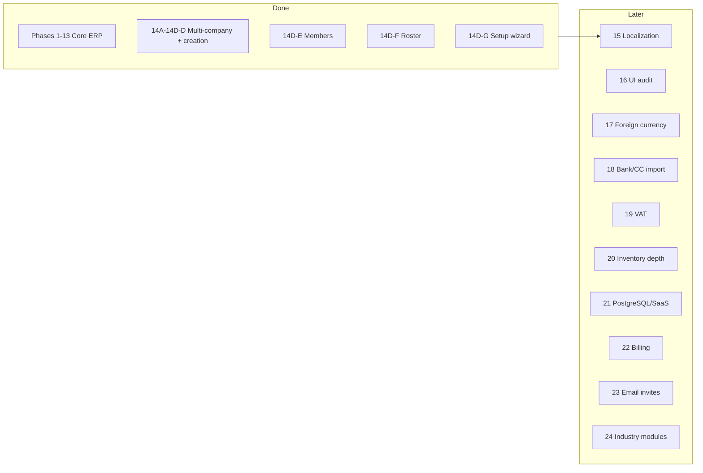

# ERP Development Roadmap

**Project:** `streamlit_accounting_erp`  
**Last updated:** 2026-06-05 (PARTNER-STATEMENT-01 P4 shipped)  
**Companion docs:** [ARCHITECTURE_HANDOFF.md](./ARCHITECTURE_HANDOFF.md) · [PHASE_18_DESIGN_REVIEW.md](../PHASE_18_DESIGN_REVIEW.md) · [docs/NAVIGATION_AUDIT.md](./docs/NAVIGATION_AUDIT.md)

This roadmap defines **what is done**, **what is active**, and **what comes next** — in order. Do not skip phases without an explicit architecture decision.

---

## Status at a glance

| Area | Status |
|------|--------|
| Core ERP & accounting engine | ✅ Complete |
| Multi-company isolation | ✅ Complete |
| Company settings isolation (14D-B) | ✅ Complete |
| Settings / module registry (14D-B2a) | ✅ Complete |
| COA & categories per company (14D-C) | ✅ Complete |
| Company creation (14D-D) | ✅ Complete |
| Sidebar uses company role (nav fix) | ✅ Complete |
| Simplified Company Setup UI | ✅ Complete (Expert policies stub) |
| Automated tests | ✅ **1217 passing, 2 xfailed** (run `pytest tests/` on host) |
| Member management (14D-E) | ✅ Complete |
| Member roster polish (14D-F) | ✅ Complete |
| Setup wizard v1 (14D-G) | ✅ Complete — **superseded by SETUP-01** |
| SETUP-01 Company Creation Wizard | ✅ **Built and tested** (reconciled 2026-06-10) — `registry/setup01_wizard.py` + `ui/setup01_wizard.py` (`render_setup01_wizard`) + wizard CSS/locales; tests: `setup01_wizard_b1/b2/b3`, `setup01_i18n`, `setup01_error_messages`, `setup01_entry_regression` |
| SETUP-02 Setup Summary | 📋 Medium — planned |
| SETUP-03 Configuration Health Check | 📋 Medium — planned |
| BANK-03 POS Settlement wording | ✅ **Verified** (2026-06-05 — locales EN/TR; `tests/test_bank03_wording.py`) |
| BANKING-POS-WORKFLOW-01 P1+P2 | ✅ Shipped — Other Income Sales Revenue guardrails + POS Settlement explainer (no posting changes) |
| **BANKING-UX-02** — POS Settlement Transparency | ✅ **Complete** — P1 preview · P1B focused entry · P2 clearing visibility · P3 unsettled list · P4 match check (no posting changes) |
| PARTNER-UX-01 P1–P3 | ✅ Shipped — Partner movement explanations, advance warnings, Summary plain labels (no posting changes) |
| PARTNER-STATEMENT-01 P1 | ✅ Shipped — read-only Partner Statement tab (month/quarter/year/custom); profit by fiscal period end-date; no posting changes |
| PARTNER-STATEMENT-01 P2 | ✅ Shipped — detail lines, running position, Excel export |
| PARTNER-STATEMENT-01 P3 | ✅ Shipped — PDF export + print-friendly report UI |
| PARTNER-STATEMENT-01 P4 | ✅ Shipped — all-partners settlement summary (P1 projection rollup; Excel/CSV/PDF export) |
| Localization EN/TR (15) | ✅ Complete |
| DEVELOPMENT_MODE | ✅ **Resolved by DEV-AUTH-01** — env-gated dev mode: `DEV_MODE = os.getenv("ERP_DEV_MODE", "0") == "1"` (default off). **Production checklist: must not run with `ERP_DEV_MODE=1`** |
| Shell / mobile chrome (Phase A) | ✅ Stabilized — fixed header, 968px breakpoint, People hub wired |
| Sidebar / navigation redesign (AD-UI-001) | 🟡 **D1 + D2-P0 shipped** — Financial Statements routes + promoted daily lookup route (app.py `AD-UI-001 D2-P0` wrapper); D2+ remainder gated — see [NAVIGATION_AUDIT.md](./docs/NAVIGATION_AUDIT.md) §16 |
| **MOB-AT-C1** — Concept C Mobile AT UI | ✅ **Accepted** — reference implementation; 747 tests passing |
| **MOBILE-11** — Mobile Design System | ✅ **Approved** — `docs/MOBILE_UI_SYSTEM.md` is the governing document for all future mobile work |
| **MOBILE-12** — Design Governance | ✅ **Approved** — open decisions recorded; phased migration path defined |
| ERP-Wide UI Ownership Principle | ✅ **Approved** — governs all CSS work going forward |
| **CSS-01** — Theme Ownership Consolidation | 🟡 **HIGH** — approved; ownership map for existing CSS |
| **CSS-02** — ERP-Wide UI Ownership Standard | 🟡 **HIGH** — approved; 8 enforceable rules; ongoing standard |
| **MOBILE-14** — Mobile Theme Ownership Cleanup | ✅ **Closed** (M1+M2+M5+M6+TXH) · M3/M4 optional xfails remain |
| **THEME-CONTRAST-01** — Desktop/Theme Contrast (P0+P1) | ✅ **Closed** — primary fill + success/warning text tokens (2026-06-05) |
| **LOGIN-01** — Login / Company Picker Modernization | ✅ **Closed** — flat auth cards; `ui/auth.css` sole owner (2026-06-05) |
| **DASHBOARD-01** — Dashboard Visual Refresh | ✅ **Closed** — D1 flat welcome + micro-text; D2 class system + KPI variant-only API |
| **QUICK-ENTRY-01** — Context-Aware Mobile Category Selection | ✅ **DONE** — implemented; 14/14 tests passing (2026-06-10) |
| **ADD-TXN-BR-01** — Sale validation vs bookkeeping rules | ✅ **Closed** — manual + pytest verified (2026-06-10) |
| **AT-LIGHT-01** — Mobile AT Light-Mode Polish (P1–P6) | ✅ **Closed** — manual phone/POS verification complete (2026-06-10) |
| **DATE-01** — Fast Mobile Date Entry | ✅ **Closed** — mobile date sheet + rollover + backdated marker (2026-06-10) |
| **UX-01** — Session Persistence (v1) | ✅ **Closed** — signed restore token + company revalidation (2026-06-10) |
| **TXH-DETAIL-01** — Transaction Detail JE/Edit History Polish | ✅ **Closed** — semantic classes + readable grid (2026-06-05) |
| **VIEWPORT-SYNC-01** — JS/CSS Mobile Threshold Sync | ✅ **Closed** — align-up to 1366px touch tablets (2026-06-05) |
| **UX-02** — Responsive Viewport & Device Auto-Fit | ✅ **Superseded** — reduced to VIEWPORT-SYNC-01 (HDR-01/MOBILE-14/UX-01 covered rest) |
| **HDR-01** — Combined Header Pass (UX-07 + UX-06) | ✅ **Closed** — responsive selector, ellipsis, toolbar cluster (2026-06-10) |
| **UX-03** — Inline Expense Category Creation | ✅ **Closed** — Expense picker search CTA (2026-06-10) |
| **UX-04** — Selector Interaction Audit | ✅ **Closed** — UX-04A/B/C + Repeat v1 (2026-06-10) |
| **UX-04A** — Post-Save State Retention | ✅ **Closed** — subcategory/customer/worker field fix (2026-06-10) |
| **UX-04B** — Payment Method Chips (mobile) | ✅ **Closed** — inline PM chip row (2026-06-10) |
| **UX-04C** — Safe Smart Defaults | ✅ **Closed** — PM memory + single-bank auto-pick (2026-06-10) |
| **Repeat Last Transaction (v1)** | ✅ **Closed** — TXH row action, Expense/Purchase only (2026-06-10) |
| **UX-05** — Universal Outside-Tap Dismiss | 📋 Backlog — last; needs separate infrastructure audit + tests |
| **CHART-01** — Chart Theme Consolidation | ⚠️ **Needs short verification pass** — `chart_theme_tokens()` exists in `ui/theme.py` but has 0 app.py call sites; 0 native `st.bar_chart`/`st.line_chart` remain (AUDIT-01 counted 6). Charts migrated or removed — verify before trusting status (reconciled 2026-06-10) |
| **AUDIT-01** — ERP Ownership Audit | ✅ **Complete** — findings recorded; quick wins identified |
| Future UX / navigation vision | 📋 **Low** — design direction only (MOBILE-07–12, DESIGN-05, DESKTOP-04) — implementation gated on MOBILE-11 system |
| **PROFILE-PHOTO-01** — Profile photo / avatar upload | 📋 **Proposed** · Low — UX only; no accounting impact |
| **UI-STAB-01** — Shared avatar renderer | ✅ **Complete** — `ui/avatar.py`; header, mobile profile, My Account, login tiles |
| **UI-STAB-02** — Banking presentation separation | ✅ **Complete** — `ui/banking.py`; P1–P4 + P1B presentation; posting stays in `app.py` |
| UI architecture stability (UI-STAB) | 📋 **Planned** — header CSS consolidation remainder; avatar + banking presentation shipped |
| Operational friction log (OBS-01) | 🟡 **Active** — record real-world UX friction; 3+ occurrences → roadmap candidate |
| **ARCHITECTURE-PROTECTION-01** | 🟢 **Active immediately** — service-first, migration-safe development rule |
| **VENDOR-NEUTRAL-01** | 🟢 **Active immediately** — no vendor-specific core architecture; generic external-source pattern |
| **MIGRATION-READINESS-01** | 🟢 **Active immediately** — FastAPI/React-ready service design checklist; exemplars: DSC-P1 · RC-P1 |
| **DAILY-SALES-CLOSE-01** | ✅ **DSC-P1–P2 complete** · 📋 **DSC-P3–P4 pending** — source-neutral external sales verification (no posting); see [docs/DAILY_SALES_CLOSE_01_SPEC.md](./docs/DAILY_SALES_CLOSE_01_SPEC.md) · [TECH_DEBT](./docs/TECH_DEBT_AND_MIGRATION_CLEANUP.md) |
| **RECIPE-COSTING-01** | ✅ **RC-P1 complete** · 📋 **RC-P1b–P3 pending** — ingredient/recipe cost service (no inventory, no UI); see [TECH_DEBT](./docs/TECH_DEBT_AND_MIGRATION_CLEANUP.md) (TD-RC-*) |

---

## Current priority

**Use the system daily** — build only what causes friction during real bookkeeping.

**Recently closed:** **THEME-CONTRAST-01** (P0 primary fill + P1 success/warning text tokens; WCAG contrast tests). Host pytest: **943 passed, 2 xfailed** (2026-06-05). **LOGIN-01** and **MOBILE-14** closed prior.

**Next recommended active item:** operational friction log (**OBS-01**) during daily use — build only what causes real bookkeeping friction.

**Short verification passes pending:** **CHART-01** (helper call sites / chart migration state).

(SETUP-01 reconciled as built and tested — removed from active list, 2026-06-10.)

**CSS architecture cleanup:** **MOBILE-14 closed.** Optional follow-up: M3/M4 suppression-rule relocation in `widgets.css` (not blockers). **CSS-01** / **CSS-02** remain the ongoing ownership standard.

**Observe during use (do not build yet):** Dashboard quick actions, worker advance mobile parity, BANK-01 reality audit (after weeks of real card/bank activity). Log friction in **[OBS-01](#obs-01--operational-friction-log)** as it happens.

**Deferred:** Inventory expansion, procurement, CRM, BI, PostgreSQL — until real usage demands them.

**Do NOT start (future projects — see [FUTURE UX / NAVIGATION VISION](#future-ux--navigation-vision)):** Banking redesign · Reports redesign · Mobile shell redesign · Navigation redesign · More Hub redesign · Sidebar redesign.

**Next Banking work (before Banking redesign or new Banking features):** observe daily friction via **[OBS-01](#obs-01--operational-friction-log)**.

**Current focus stays on:** (1) Accounting stability · (2) Daily-use workflow testing · (3) Banking observation · (4) UX cleanup · (5) Real-world usage feedback.

**Success metric:** Daily sales, expenses, and purchases are easy to enter; banking is understandable; month-end is fast; company switching is reliable — not feature count.

---

## ARCHITECTURE-PROTECTION-01 — Service-First Development Rule

**Status:** Active immediately

**Rule:** All new modules must be **service-first** and **migration-safe**.

**Required order:**

1. Database models
2. Service / business logic
3. Tests
4. Minimal Streamlit UI only if useful

**Strict rule:**

- Streamlit must **not** own business logic.
- Business rules must live **outside** `app.py`.
- Accounting logic must live in **reusable services**.
- Tests are the authority.

**Reason:** Future target is FastAPI + React ([FUTURE-MIGRATION-01](#future-architecture--long-term-roadmap)). Any logic built correctly now must be reusable later. External systems must stay vendor-neutral ([VENDOR-NEUTRAL-01](#vendor-neutral-01--vendor-neutral-architecture-rule)).

**Warning rule:** If a feature is mainly UI-heavy, multi-user, mobile, login/auth, permissions dashboard, staff portal, uploads, or approval workflow — **pause** before building it deeply in Streamlit.

**Build now:**

- Accounting logic
- Reports logic
- Daily Sales Close service
- Recipe Costing service
- Data models
- Tests

**Defer or keep minimal:**

- Full login system
- Staff portal UI
- Mobile receipt uploads
- Complex permission screens
- Approval inbox UI
- Advanced admin/settings UI

**Future target stack:**

```
React
↓
FastAPI
↓
Services
↓
SQLAlchemy
↓
PostgreSQL
```

**Related:** [ARCHITECTURE-PROTECTION-01](#architecture-protection-01--service-first-development-rule) · [VENDOR-NEUTRAL-01](#vendor-neutral-01--vendor-neutral-architecture-rule) · [MIGRATION-READINESS-01](#migration-readiness-01--fastapireact-ready-service-checklist)

---

## VENDOR-NEUTRAL-01 — Vendor-Neutral Architecture Rule

**Status:** Active immediately

**Rule:** Core architecture must **not** depend on any named POS, restaurant, or external-system vendor. Integrations are **generic first**; vendor-specific code lives only in optional, pluggable adapters outside the core.

**Applies to:** `models.py`, `services/`, `registry/` settings keys, enums, roadmap **requirements**, service function names, module names, and Streamlit dispatch — not user-typed data or documentation examples.

### Required pattern — External Sales Source (and similar)

| Field | Rule |
|-------|------|
| `source_name` | **Free text** — user or operator labels the system (any POS, ERP, or manual source) |
| `source_type` | **Optional generic category** — e.g. `POS`, `ERP`, `MANUAL`, `Z_REPORT`, `EXCEL_UPLOAD`, `OTHER` |
| `branch_location` | Optional text |
| Totals / variance / status | Generic numeric and workflow fields — no vendor columns |

**Do not** hardcode product names (e.g. Suitable, Wolvox, Square) in enums, model fields, service branches, or roadmap implementation requirements.

### Allowed

- **Documentation examples** — vendor names in specs, handoff, or training prose only, clearly as illustrations.
- **User-entered text** — `source_name` may contain any string the operator types.
- **Domain terminology** — “POS Settlement” in banking = card clearing workflow ([BANKING-UX-02](#banking-ux-02--pos-settlement-transparency--complete)), **not** a named POS product integration.
- **Future per-provider adapters** — separate modules (e.g. DSC-P4), registered at runtime; core schema unchanged.

### Forbidden in core (Phase 1 and ongoing)

- `if source == "wolvox"` (or any named vendor) in services or `app.py`
- Enum values or settings keys named after a vendor product
- Service or model names embedding a vendor (`import_wolvox`, `SuitablePosTotals`, etc.)
- Roadmap phases that **require** a specific vendor integration in core
- Provider-specific columns on shared verification/import tables

### Exemplar

[DAILY-SALES-CLOSE-01](./docs/DAILY_SALES_CLOSE_01_SPEC.md) — External Sales Verification: manual entry, `source_name` text, optional `source_type`, no posting. Reference implementation of this rule.

### Enforcement

- New modules: comply with [ARCHITECTURE-PROTECTION-01](#architecture-protection-01--service-first-development-rule) **and** this rule.
- Design reviews: reject vendor-specific core designs; defer adapters.
- Tests (when built): contract scan — no vendor identifiers in `services/` source (see DAILY-SALES-CLOSE-01 test plan).

### Related architecture rules

| Rule | Relationship |
|------|----------------|
| [ARCHITECTURE-PROTECTION-01](#architecture-protection-01--service-first-development-rule) | Services must be reusable; vendor neutrality keeps them portable |
| [MIGRATION-READINESS-01](#migration-readiness-01--fastapireact-ready-service-checklist) | Explicit DTOs and no Streamlit coupling prepare services for FastAPI |
| [FUTURE-MIGRATION-01](#future-architecture--long-term-roadmap) | Generic services + optional adapters support FastAPI/React migration |
| [DAILY-SALES-CLOSE-01](./docs/DAILY_SALES_CLOSE_01_SPEC.md) | First feature spec written under this rule |

---

## MIGRATION-READINESS-01 — FastAPI/React-Ready Service Checklist

**Status:** Active immediately

**Rule:** Every new `services/` module must be designed as if a **FastAPI route will call it next** — even while Streamlit remains the only UI.

**Required properties:**

| # | Property |
|---|----------|
| 1 | Business logic in `services/` (or `registry/` helpers), **not** `app.py` |
| 2 | **No** Streamlit imports, `st.session_state`, `cq()`, or `_current_user()` in services |
| 3 | **Explicit inputs** — `company_id`, `user_id`, dates, and request DTOs passed as parameters |
| 4 | **Serializable outputs** — frozen dataclasses or typed records with `to_dict()` (no ORM rows at the public boundary) |
| 5 | **Pure validation/math** separated from persistence (`validate_*`, `compute_*` with no DB) |
| 6 | **Tests runnable without Streamlit** — in-memory SQLite + explicit `company_id` |
| 7 | **Contract tests** — posting-guard scan; vendor-neutrality scan where applicable |
| 8 | **Known debt logged** in [TECH_DEBT_AND_MIGRATION_CLEANUP.md](./docs/TECH_DEBT_AND_MIGRATION_CLEANUP.md) |

**UI layers (Streamlit now, React later) may only:**

- Read session/auth context
- Map form state → service DTOs
- Call service functions with explicit `company_id` / `user_id`
- Render service return values (metrics, tables, errors)

**Exemplar:** [DSC-P1](./docs/DAILY_SALES_CLOSE_01_SPEC.md) — `services/daily_sales_close.py` (`ExternalSalesVerification`).

### Implementation report — Migration Cleanup (required)

Every implementation handoff or completion report must end with a **Migration Cleanup** section covering:

1. **Code to keep** during FastAPI/React migration (services, models, tests, DTOs)
2. **Code likely to replace** (Streamlit renderers, `app.py` dispatch, session-key wiring)
3. **Dead code found** (if any)
4. **Temporary Streamlit-only code** (`st.session_state`, `_erp()` lazy imports, widget keys)
5. **Items added to** [TECH_DEBT_AND_MIGRATION_CLEANUP.md](./docs/TECH_DEBT_AND_MIGRATION_CLEANUP.md)

Template lives in [TECH_DEBT § Implementation report template](./docs/TECH_DEBT_AND_MIGRATION_CLEANUP.md#implementation-report--migration-cleanup-template).

**Related:** [ARCHITECTURE-PROTECTION-01](#architecture-protection-01--service-first-development-rule) · [VENDOR-NEUTRAL-01](#vendor-neutral-01--vendor-neutral-architecture-rule) · [FUTURE-MIGRATION-01](#future-architecture--long-term-roadmap) · [TECH_DEBT_AND_MIGRATION_CLEANUP.md](./docs/TECH_DEBT_AND_MIGRATION_CLEANUP.md)

---

## DAILY-SALES-CLOSE-01 — Implementation status

| Phase | Status | Deliverable |
|-------|--------|-------------|
| **DSC-P1** | ✅ **Complete** | `ExternalSalesVerification` model · `services/daily_sales_close.py` · service/model tests · schema indexes |
| **DSC-P2** | ✅ **Complete** | Minimal Streamlit under Closings · `ui/external_sales_verification.py` · UI contract tests |
| **DSC-P3** | 📋 **Pending** | Attachment metadata · EOD warning hook · export |
| **DSC-P4** | 📋 **Pending** | Optional per-provider import adapters (outside core) |

Spec: [docs/DAILY_SALES_CLOSE_01_SPEC.md](./docs/DAILY_SALES_CLOSE_01_SPEC.md). Tech debt: [docs/TECH_DEBT_AND_MIGRATION_CLEANUP.md](./docs/TECH_DEBT_AND_MIGRATION_CLEANUP.md) (TD-DSC-*).

---

## RECIPE-COSTING-01 — Implementation status

| Phase | Status | Deliverable |
|-------|--------|-------------|
| **RC-P1** | ✅ **Complete** | `Ingredient` · `Recipe` · `RecipeLine` models · `services/recipe_costing.py` · service/model tests · schema indexes |
| **RC-P1b** | 📋 **Pending** | Design spec (`RECIPE_COSTING_01_SPEC.md`) · list/read service APIs |
| **RC-P2** | 📋 **Pending** | Minimal Streamlit UI · nav · UI contract tests |
| **RC-P3** | 📋 **Pending** | Export · menu linkage · profitability views (no inventory in RC-P1 scope) |

Tech debt: [docs/TECH_DEBT_AND_MIGRATION_CLEANUP.md](./docs/TECH_DEBT_AND_MIGRATION_CLEANUP.md) (TD-RC-*).

---

## OBS-01 — Operational Friction Log

**Status:** Active (observation only — no implementation from this log alone)

**Purpose:** Every UX change must originate from **repeated real-world friction**, not speculation or audit findings alone. Use this log during daily bookkeeping to capture what actually slows work down.

**Gate:** Only issues experienced **3+ times** become roadmap candidates. Fewer occurrences stay in the log until the pattern repeats or is dismissed.

**How to use:**

1. After each friction moment, add a row (Screen · Task · Issue · Frequency · Impact).
2. Increment **Frequency** on repeat encounters (same screen + task + issue).
3. At **Frequency ≥ 3**, promote to a roadmap item (new `UX-*` / `OBS-*` candidate or elevation of an existing planned item) — still requires explicit approval before build.
4. Architecture-audit items (**UI-STAB**, **FUTURE UX**) inform technical debt but do **not** bypass this gate for user-facing UX changes.

| Screen | Task | Issue | Frequency | Impact |
|--------|------|-------|-----------|--------|
| *(add entries during daily use)* | | | | |

**Impact scale (suggested):** Low = annoyance · Medium = extra steps or errors recoverable · High = blocks daily workflow or risks bad data.

**Cross-references:**

| Related | Relationship |
|---------|--------------|
| **Current priority** | “Use the system daily” — this log is where observations land |
| **UI-STAB** | Technical separation debt — not a substitute for friction evidence |
| **FUTURE UX** | Design vision — requires OBS-01 friction before implementation |

---

## SETUP & Onboarding phase

### SETUP-01 — Company Creation Wizard 🟡 **HIGH** (design approved)

**Goal:** Every new company starts with the correct accounting workflow from day one.

**Runs when:** First company created · additional company created · future branch/location/company created.

**Replaces:** 14D-G 3-step wizard (business type → accounting mode → modules on Company Settings only). SETUP-01 runs at **company creation** and sets banking defaults so owners never need Banking → Settings on day one.

**Tone:** “Help me set up my company correctly” — plain language, no unexplained jargon. Each question includes: simple question, options + explanations, what changes in the ERP, change later (yes/no + where).

| Step | Question (summary) | Maps to |
|------|-------------------|---------|
| **1** | Business type (Restaurant / Retail / Service / Other) | `setup.vertical_template` — defaults & reporting only; no posting change |
| **2** | Customer card sales: know bank immediately vs later from POS/statement | `banking.card_settlement_enabled` OFF vs ON (POS Settlement). **Not** Company Credit Card |
| **3** | Import/reconcile bank statements? | `banking.reconciliation_enabled` |
| **4** | Pay suppliers/expenses with company credit card (KK)? | `banking.company_card_enabled` — not customer POS |
| **5** | Track stock (food, beverages, supplies)? | `module.inventory.enabled` |
| **6** | Multi-currency? | `module.foreign_currency.enabled` / future FX prefs |
| **7** | Daily operations style (Relaxed / Balanced / Strict) | `policy.accounting_mode` + policy bundle |
| **8** | **Summary** — company name + all choices → user confirms → create company |

**Step 2 detail (locked):**

- **Option A — I know immediately** → Card settlement **OFF** → card sales go **directly to Bank**
- **Option B — I know later** → Card settlement **ON** → card sales go to **POS Settlement** first; Bank updated at settlement/match

**Step 8 summary fields:** Company name · Business type · POS Settlement · Statement import · Company credit card · Inventory · Multi-currency · Control level.

**Status:** Design approved · implementation not started.

---

### SETUP-02 — Company Settings Review 📋 **Medium**

**Add:** Settings → Company Profile → **Setup Summary**

Shows wizard choices; read-only review (and link to change paths). Complements SETUP-01.

**Status:** Planned.

---

### SETUP-03 — Configuration Health Check 📋 **Medium**

Advisory warnings only (no forced changes). Examples:

- POS settlement OFF but statement import enabled
- Multi-currency OFF but foreign-currency transactions detected
- Company credit card enabled but no card accounts configured

**Status:** Planned.

---

### BANK-03 — Wording update ✅ **Verified**

Rename user-facing **“Card Settlement”** → **“POS Settlement”** (settings toggle) and **“POS / Card Settlement”** (focused workflow chip).

Keep **“Card Sales Clearing”** for COA / account names only. Retire jargon: **card clearing**, **clearing sales**, **deposit clearing**, **BSI** in user-facing copy.

**Purpose:** Reduce confusion with Company Credit Card (KK).

**Status:** Verified 2026-06-05 after BANKING-UX-02 + UI-STAB-02 — locale sweep EN/TR; Banking page title uses `NAV_BANKING`; contract tests in `tests/test_bank03_wording.py`.

---

### BANKING-POS-WORKFLOW-01 — POS Settlement workflow UX ✅ **P1+P2 shipped**

**P1:** Demote Sales Revenue in Other Income match path; double-count + POS-deposit warnings (no posting block).

**P2:** Card Sale Deposit panel explainer + Banking Settings POS Settlement caption line.

**Not in scope (P3+):** Auto-preselect clearing sales, dashboard clearing balance, posting/matching changes. Deferred to [BANKING-UX-02](#banking-ux-02--pos-settlement-transparency).

---

### BANKING-UX-02 — POS Settlement Transparency ✅ **Complete**

**Status:** Complete  
**Priority:** High (shipped June 2026)

**Completed phases:**

| Phase | Deliverable |
|-------|-------------|
| **P1** | Settlement preview — amounts and warnings before post |
| **P1B** | Focused **POS / Card Settlement** entry on Banking (no import chrome) |
| **P2** | Card Sales Clearing (1150) visibility panel |
| **P3** | Unsettled card sales list with filters |
| **P4** | Match check — plain-language failure explanations |

**Reason (original):** User testing showed Card Sales Clearing works correctly in accounting, but users could not easily locate or understand it during **Banking → Match & Post**. Workflow visibility was weak; the goal was transparency, not accounting redesign.

**Current flow (correct, hard to see):**

```text
Sales Entry → Card Sales Clearing → Bank Deposit → POS Settlement Match → Bank
```

Users cannot easily see the middle stage (**Card Sales Clearing**): outstanding clearing balance, unsettled sales, or why a deposit can or cannot be matched.

**Ordering:** After [BANKING-POS-WORKFLOW-01](#banking-pos-workflow-01--pos-settlement-workflow-ux--p1p2-shipped). Before any new Banking feature development or Banking redesign.

**Unchanged by design:** Revenue recognition · `post_deposit_clearing_match` JE · matching algorithms · Card Sales Clearing account **1150**.

**Tests:** `tests/test_banking_ux02_p1.py` · `p1b` · `p2` · `p3` · `p4` (79 tests). See [docs/COMPLETED_FEATURES.md](./docs/COMPLETED_FEATURES.md).

---

#### Phase P1 — Settlement Match Preview ✅

**Where:** Banking → Statement Import → Match & Post → Card Sale Deposit / POS Settlement

**Show:**

- Number of unsettled card sales
- Gross sales waiting for settlement
- Bank deposit amount
- Estimated / actual POS fee
- Clear explanation: *"This clears Card Sales Clearing and moves money into Bank. It does not create new Sales Revenue."*

**Target outcome:** Users understand exactly what **Confirm & Post** will do before posting.

---

#### Phase P2 — Card Sales Clearing Visibility ✅

Add visible **Card Sales Clearing** balance.

**Possible locations:** Dashboard **or** Banking → Accounts & Transactions

**Show:**

```text
Card Sales Clearing
TRY X waiting settlement
```

**Optional action:** View unsettled card sales

---

#### Phase P3 — Unsettled Card Sales List ✅

Drill-down list:

| Column | |
|--------|---|
| Date | |
| Reference | |
| Amount | |
| Settlement status | |

**Totals:** Waiting Settlement = X

**Purpose:** Users can identify what remains unmatched.

---

#### Phase P4 — Match Failure Explanation ✅

When **Confirm & Post** is unavailable, replace vague messaging with:

- **"No unsettled card sales found."**
- Explain: current Card Sales Clearing balance, candidate count, date-window mismatch if applicable

**Purpose:** Help users understand why settlement matching is unavailable.

---

**Dependencies:** No accounting changes required.

**Do not modify:**

- `post_card_sale`
- `post_deposit_clearing_match`
- Matching algorithms
- Database models

**Scope:** UX and visibility only.

---

## Phase map (high level)



---

## ✅ Completed phases

### Phases 1–13 — Core ERP

Dashboard, sales, expenses, purchases, customers, vendors, banking, AR/AP, reports, GL, trial balance, P&L, balance sheet, cash flow, attachments, audit log, fiscal/year-end close, partners, profit allocation, cash reconciliation, EOD close, recurring expenses, backup/restore, opening balances.

### Phase 14A — Multi-company foundation

`Company`, `CompanyUser`, `CompanySetting`; `company_id` on business tables; default `company_1`.

### Phase 14B — Company context

Login → company picker; `active_company_id`, `active_company_role`, `active_company_name`.

### Phase 14C — Data isolation

`cq(session, Model)`; auto-stamp on flush; isolation tests.

### Phase 14D-A — Company model

`full_name`, `email`, `phone`, `created_by_user_id`; `CompanyUser.invited_by_id`.

### Phase 14D-B — Company settings isolation

`load_settings()` / `save_settings()` company-scoped; legacy `AppSetting` for global/user prefs only.

### Phase 14D-B2a — Registry foundation ✅ *just completed*

**Delivered:**

| Item | Location |
|------|----------|
| Settings catalog (keys, scope, type, lock metadata) | `registry/settings_catalog.py` |
| Module catalog (ids, nav mapping, planned flags) | `registry/modules_catalog.py` |
| Accounting mode bundles (stub) | `registry/accounting_mode_bundles.py` |
| Loader + validation | `registry/loader.py` |
| Read helpers | `registry/service.py` — `get_setting`, `get_effective_config`, `get_module_state`, `evaluate_lock` |
| Startup validation | `app.py` imports `validate_on_load()` |
| Tests | `tests/test_phase14b2_registry.py` (+16 tests) |

**Explicitly NOT in B2a:**

- Workspace / favorites UI  
- Policy enforcement in posting  
- `set_setting()` writes through registry  
- Industry presets  
- Subscription entitlements  
- `company_module` database tables  

### Phase 14D-B2b — Setting lock enforcement ✅

| Item | Location |
|------|----------|
| Milestones | `get_company_milestones()` — `first_posted_at` from min `JournalEntry.entry_date` |
| Guarded writes | `set_setting(..., check_locks=True)`, `save_company_settings_batch()` |
| Lock errors | `SettingLockError` + EN/TR `registry.lock.*` messages |
| Company Settings UI | `render_company_settings` — batch save; block on currency, warn is advisory only |
| Tests | `tests/test_phase14b2_registry.py` (milestones, block, warn+confirm) |

### Phase 14D-C — COA per company ✅

| Item | Location |
|------|----------|
| Per-company COA seed | `registry/coa_seed.py` |
| Per-company categories | `registry/categories_seed.py` |
| Startup backfill for company_1 | `_ensure_company_1_provisioned()` |
| Tests | `tests/test_phase14c_coa_per_company.py` |

### Phase 14D-D — Company creation ✅

| Item | Location |
|------|----------|
| `create_company()` | `registry/company_provision.py` |
| Picker UI | “Create a new company” expander on company picker (auto-opens when user has no company) |
| Header shortcut | Profile menu → **Create company** (any signed-in user) |
| Zero-membership login | Allowed; picker shows create-first-company flow; new company auto-activates |
| Tests | `tests/test_phase14d_company_creation.py` |

### UX pass ✅

- Sidebar menu uses **company role** (`active_company_role`)  
- **Company Setup** page: Profile + Money & books + Expert stub  

---

## 🔜 Phase 14D — Company management (remaining)

### 14D-E — Member management ✅ **DONE**

**Goal:** Owner manages `CompanyUser` for active company.

**Delivered:** Administration → **👤 Members** (and Company Settings section): add existing user, create user + add, change role, deactivate/reactivate, remove from company; per-company last-owner guard; audit log entries; `registry/company_members.py` helpers.

**Roles:** owner, manager, partner, cashier, viewer.

**Rules:**

- **`CompanyUser.role`** only for access — not `User.role`  
- **Last owner guard** — cannot remove/deactivate/demote last active owner  
- Option A invites only (no email tokens yet)

---

### 14D-F — Member roster polish ✅ **DONE**

**Delivered:** Members page **Roster** tab (search, role/status filters, paginated table, Excel/PDF export); role badge counts in company overview; last login, invited by, member since columns; **Company Setup** and legacy Settings team overview; **Add & manage** tab for 14D-E actions.

### 14D-G — Setup wizard v1 ✅ **DONE** *(legacy — see SETUP-01)*

**Delivered:** 3-step wizard on **Company Setup** — business type → accounting mode → optional modules. Writes registry defaults to `CompanySetting` (vertical, mode, policy bundle, module toggles, `setup.wizard_completed`). Module prefs affect `get_module_state` (e.g. inventory off). Policy enforcement still deferred.

**Gap:** No banking/POS questions at company creation; owners must discover **Banking → Settings** separately — caused inconsistent per-company config (e.g. settlement ON vs OFF). **SETUP-01** (design approved) addresses this.

---

## Phase 15 — Localization (EN / TR) — ✅ **Complete**

**15a — Shell ✅:** Login, picker, header, sidebar nav, Company Setup, Members, wizard.

**15b — Daily ops ✅:** `_st_page_title()` on all `st.title` pages; **Home** dashboard banner/KPIs; **Sales** and **Expenses** forms/filters; **Add Transaction** header. Strings in `registry/locales/transactional.py`.

**15c — CRM slice ✅:** **Vendors**, **Purchases**, **Customers** — forms, filters, void flow, statements, manage rows. Shared `form.*` keys; `PURCHASE_TYPE_I18N` / `PURCHASE_GL_I18N`.

**15d — AR/AP + Banking ✅:** **Payables**, **Receivables**, **Banking** — forms, filters, KPIs, payments, void, CSV import header.

**15e — Reports & GL ✅:** **Reports** hub (exec + management tabs), **General Ledger**, **Trial Balance**, **P&L** / **Today's Summary** banners, sidebar date range, aging buckets, cash recon shell, shared table column headers (`_localize_df`).

**15f — Financial close ✅:** **Balance Sheet**, **Cash Flow**, full **Cash Reconciliation** (4 tabs), **End-of-Day Close**, management-report KPI labels, export popover (Excel/CSV/PDF title).

**15g — Export copy & remaining KPIs ✅:** Export section labels in P&L / BS / CF exports; EOD history detail metrics; fiscal period KPI labels; management-report growth captions and empty-state messages; `_DF_COL_I18N` extended with 8 new column headers.

**15h — Broad coverage ✅:** All major pages localized — Year-End Close, Fiscal Periods, Audit Log, Partners/Equity, Opening Balances, Add Transaction, Transaction History, Journal Entries, Recurring Expenses, Customer Ledger, Inventory, COA, Budget, Categories, Administration, Backup & Restore, My Account. ~185 new EN+TR key pairs across 18 namespaces (`yec`, `fiscal`, `audit`, `partner`, `ob`, `txn`, `je`, `recurring`, `ledger`, `inv`, `coa`, `budget`, `rpt`, `cat`, `admin`, `backup`, `myaccount`, `form` common).

**15i — Cleanup pass ✅:** A follow-up audit found ~70 hardcoded strings still slipping through in less-trafficked code paths (the earlier "0 remaining" claim was premature). Localized: attachment list/upload form, year-end-close validation success/error/warning messages and acknowledgements, Fiscal Periods action buttons & confirm warnings, Equity Movements (new-movement expander, current-account/advance labels & warnings), Add-Transaction inline errors + supplier-payment payable guards + currency/FX/notes/save-button copy, Transaction History row-button tooltips + full detail panel field labels + edit panel, Journal Entries manual-entry section, COA balance summary, Sales/Expense void sections, recurring drafts/notes, bank CSV preview/import, category & subcategory inline help/placeholders, Advanced admin expander titles + migration/flag labels, Backup & cloud-sync copy, My Account password button, and the header search box + notifications popover. **130 new EN+TR key pairs (1221 keys each side, full parity); 0 known hardcoded user-facing strings remaining. 245 tests passing (incl. 2 new 15i tests).**

---

## Phase 16 — UI / theme audit

Complete dark mode, readability, header/sidebar polish, mobile pass.  
**Plan:** [PHASE_16_AUDIT.md](./PHASE_16_AUDIT.md)

### Phase 16A — Foundation ✅

| Item | Location |
|------|----------|
| Global CSS extracted | `ui/theme.css` |
| Tokens + bootstrap | `ui/theme.py` — `bootstrap_theme()`, DB theme on each `main()` |
| Section header helper | `ui/section.py` |
| Streamlit baseline | `.streamlit/config.toml` |
| Page audit matrix | `PHASE_16_AUDIT.md` |
| Tests | `tests/test_phase16a_theme.py` |

### Phase 16B — Native widgets ✅

| Item | Location |
|------|----------|
| Widget dark/light CSS | `ui/widgets.css` (inputs, select, tabs, expander, forms, alerts, metrics, `border=True` containers) |
| Streamlit version pin | `requirements.txt` — `>=1.28,<2` |

### Phase 16C — Page sweep ✅

| Item | Location |
|------|----------|
| Page banners → `section_header_html()` | 18 blocks (audit, txn history, partner, equity, opening balances, advanced, recon, EOD, reports, members, wizard, company setup, settings) |
| Muted/section text → `var(--theme-muted)`; dark text → `var(--theme-text)` | section helpers, captions, txn party names, audit/JE diffs, neutral KPI values |

### Phase 16D — Header + responsive ✅

| Item | Location |
|------|----------|
| Header `📊 Accounting ERP · {company} · {user}` w/ truncation | `render_top_header`, `ui/theme.css` |
| Responsive KPI grid (1 col ≤640px) + mobile sidebar drawer (≤768px overlay) | `ui/theme.css` |

### Phase 16E — Pastel banners + QA ✅

| Item | Location |
|------|----------|
| Aging chips, P&L / cash-flow / balance-sheet headers, badges, Budget Styler → `color-mix` theme tints | `app.py` |
| Tests (responsive, header, no-hardcoded-pastel guards) | `tests/test_phase16a_theme.py` |

**Phase 16 complete.** Full suite green (274 tests). Remaining decorative hex (status dots, white-on-color pills, `#9ca3af` footnotes) intentionally kept. EN/TR × light/dark screenshot pass + a real ≤768px device check recommended before release.

---

## AD-UI-001 — Sidebar & navigation redesign *(Option D — phased)*

**Status:** **Phase D1 complete** (2026-06-05). **Priority: High.** D2+ not started.

**D1 delivered:**

- Top-level **Financial Statements** nav (desktop accordion + mobile Reports/More hubs).
- Thin routes: `render_profit_loss_page`, `render_balance_sheet_page`, `render_cash_flow_page` → unchanged calculators.
- Reports Executive no longer lists P&L / BS / CF.
- Legacy Executive deep-links redirect; date filters on statement pages match Reports.
- Tests: `tests/test_nav_statements_d1.py`.

**D2+ (gated):** Executive rename, TB/GL/Budget dedup, Transaction History sidebar move, Reports tab rework.

**Explicitly out of scope (all phases):** GL posting rules, AD-001–AD-015 accounting behavior, new report renderers.

**Future direction (not D2+ — see below):** Full mobile shell, bottom-nav, More Hub, and compact sidebar modernization are recorded under **[FUTURE UX / NAVIGATION VISION](#future-ux--navigation-vision)**. AD-UI-001 D2+ remains incremental route/tab cleanup; it is **not** a rebuild of mobile chrome or the More menu.

**Reference:** [NAVIGATION_AUDIT.md](./docs/NAVIGATION_AUDIT.md) §16 (D1), §2–6 (pre-audit).

---

## FUTURE UX / NAVIGATION VISION

**Status:** Planned Future Work  
**Priority:** Low  
**Not approved for implementation.** Design direction only.

Record approved future-direction decisions so they are not forgotten. **No code, no screen redesign, no sprint** until explicitly approved.

**Cross-references (do not duplicate):**

| Existing roadmap item | Relationship |
|----------------------|--------------|
| **AD-UI-001** | D1 statement routes done; D2+ = incremental Reports/sidebar dedup — **not** this vision |
| **Phase 18-MUX** | Mobile Add Transaction shipped; **current bottom nav unchanged** |
| **Phase 16D** | Header foundation (truncation, responsive) — **not** MOBILE-10 compact SaaS header |
| **SETUP-01 / SETUP-02 / SETUP-03** | Onboarding at company creation — separate from **DESIGN-05** progressive disclosure |
| **Module state vocabulary** | `Hidden` = nav preference — aligns with **MOBILE-07** (see below) |

### FUTURE UX PRINCIPLE

> The ERP should prioritize **speed of daily operation** over feature visibility. Frequently used functions should be immediately accessible. Advanced or rarely-used functions should remain available but not dominate the interface.

---

### MOBILE-07 — Customizable More Hub

**Status:** Planned

**Goal:** Allow each company to choose which modules appear inside the **More** section.

This hides navigation only. It does **not** disable functionality. Users can restore hidden modules later.

**Examples:**

| Company | Visible in More | Hidden (restorable) |
|---------|-----------------|---------------------|
| Restaurant A | Banking, Reports, Receivables, Payables | Inventory, Assets, CRM, Projects |
| Restaurant B | Inventory, Purchasing, Banking | Receivables, CRM |

**Requirements:**

- Company-specific  
- Permission-aware  
- Reversible  
- Navigation visibility only  
- No accounting impact  

**Explicitly:** This is **not** user-role security. This is **UI simplification** (same idea as registry `Hidden` module state — see [Module state vocabulary](#module-state-vocabulary-frozen)).

---

### MOBILE-08 — Organized More Hub

**Status:** Planned

**Goal:** Replace long flat menu lists with **grouped sections**.

**Future structure example (illustrative only):**

| Section | Items |
|---------|--------|
| **Banking** | *(section header)* |
| **Inventory** | Products · Stock · Adjustments |
| **Accounting** | Receivables · Payables · Ledger · Journal |
| **Reports** | P&L · Balance Sheet · Cash Flow |
| **Administration** | Users · Roles · Settings |

**Do not implement now.** Future navigation cleanup project.

---

### DESIGN-05 — Progressive Disclosure

**Status:** Planned

**Principle:** New users should only see functionality required for **daily operation**. Advanced features appear when needed or enabled.

**Example — new restaurant owner (illustrative):**

| Primary chrome | Under More |
|----------------|------------|
| Home · Add · Cashflow · Ledger · More | Banking · Reports · Settings |

**Advanced areas remain hidden until enabled or required:** Inventory · Assets · Projects · CRM · Advanced analytics

**Goal:** Reduce overwhelm; keep first-day experience simple.

*Complements SETUP-01 (correct defaults at create) but applies ongoing nav/module visibility — not a replacement for onboarding wizard.*

---

### MOBILE-09 — Future Mobile Navigation Vision

**Status:** Concept approved · **not approved for implementation**

**Current navigation remains unchanged.**

**Future evaluation candidates (do not choose one yet):**

| Option A | Option B |
|----------|----------|
| Home · Add · Cashflow · Ledger · More | Home · Banking · Add · Reports · More |

**Reason:** Daily-use functions belong in primary navigation; rarely-used functions belong under More.

---

### MOBILE-10 — Mobile Header Modernization

**Status:** Planned · user preference recorded

**Future direction:** Replace oversized profile blocks and large identity cards. Move toward a **compact professional header**.

**Desired characteristics:**

- Compact company switcher  
- Compact notification button  
- Real profile avatar / photo / icon  
- Avoid large single-letter profile circles  
- Reduce vertical space usage  
- Maximize workspace  

**Reference style:** Modern SaaS mobile applications.

**Not implementation-ready.** Design direction only. *(Phase 16D delivered truncation/responsive foundation; this is a later polish pass.)*

**Prerequisite (architecture, not redesign):** **[UI-STAB-01](#ui-stab-01--header-architecture-consolidation)** — header CSS/sizing consolidation. Trigger only after compact mobile header visuals are approved.

---

### PROFILE-PHOTO-01 — Profile Photo / Avatar

**Status:** Proposed  
**Priority:** Low  
**Not approved for implementation.**

**Purpose:** Allow users to upload and display a profile photo/avatar instead of initials.

**Requirements:**

- Upload profile image (My Account → Profile tab)
- Store avatar path/reference on `User` (e.g. `avatar_path` column + file under company/user-scoped storage)
- Show avatar in header profile popover/sheet and My Account profile card
- Fallback to initials when no image exists (`erp-mono-avatar`, `erp-hdr-profile-avatar`)
- EN/TR labels (`account.profile_photo`, upload/remove/success/error keys)
- Permissions: self-service only (current user edits own avatar; no owner directory management)
- Desktop + mobile: `_render_hdr_profile_panel_content`, mobile profile sheet, login user tiles

**Non-goals:**

- Social-login avatars
- External image URLs
- User directory / admin avatar management

**Current state (June 2026):**

- `User` model has no `avatar_path` field
- `render_my_account` shows initials + `account.photo_coming` (“Upload coming in a future release”)
- Header/mobile profile use initials HTML in three places (not a single helper yet)
- [UI-STAB-01](#ui-stab-01--header-architecture-consolidation) calls for single avatar renderer — implement together or immediately before

**Suggested implementation sketch (when approved):**

1. Schema: `users.avatar_path` via `migrate_schema()`; store files under e.g. `data/avatars/{user_id}/`
2. `registry/avatar.py`: save/delete/resolve URL, validate MIME/size, initials fallback HTML helper
3. My Account Profile: `st.file_uploader` + remove button; audit log optional
4. Replace inline initials in header, mobile sheet, login tiles with shared `_user_avatar_html(user)`
5. Tests: upload round-trip, fallback, permission (cannot set another user's path), no posting changes

**Reason:** UX enhancement only. No accounting impact.

**Cross-reference:** [AUDIT_HISTORY.md](./docs/AUDIT_HISTORY.md) (mono-sweep-3 — photo was never implemented; not a regression).

---

### DESKTOP-04 — Sidebar Modernization

**Status:** Planned · user preference recorded

**Future direction:** Compact **icon-first** navigation.

**Characteristics:**

- Smaller visual footprint  
- Clear active state  
- Better hierarchy  
- Reduced clutter  
- Modern SaaS appearance  

**Important:** This is **not** a rebuild request. Preserve design intent for future UX work. *(AD-UI-001 D2+ may adjust routes/labels; DESKTOP-04 is visual/IA modernization.)*

---

### Do NOT start (explicit)

Until a separate architecture / UX approval:

- Banking redesign  
- Reports redesign  
- Mobile shell redesign  
- Navigation redesign  
- More Hub redesign  
- Sidebar redesign  

These remain **future projects**. Current focus stays on accounting stability, daily-use testing, banking observation, UX cleanup (e.g. i18n/trust fixes), and real-world usage feedback.

**Related (stability, not redesign):** **[UI-STAB](#ui-stab--ui-architecture-stability)** records audit findings for presentation separation and CSS cleanup — distinct from MOBILE-10 / DESKTOP-04 visual modernization.

---

## UI-STAB — UI Architecture Stability

**Status:** Planned  
**Not approved for implementation.**

**Purpose:** Preserve findings from the Desktop/Mobile Architecture Audit so future UI work is based on known technical debt rather than rediscovery.

**Cross-references (do not duplicate):**

| Existing item | Relationship |
|---------------|--------------|
| **Phase 16D** | Header foundation — **UI-STAB-01** consolidates distributed CSS on top of it |
| **MOBILE-10** | Compact mobile header polish — **UI-STAB-01** runs only after those visuals are approved |
| **18-MUX** | Add Transaction dual-host pattern — reference model for **UI-STAB-02** banking split |
| **AD-UI-001** | Route/sidebar dedup (D2+) — **UI-STAB-03** is nav *renderer* consolidation, not route redesign |
| **FUTURE UX** | MOBILE-07–10, DESIGN-05, DESKTOP-04 — redesign vision; UI-STAB is stability/separation first |

**Audit summary (June 2026):** Business logic separation is healthy (`_at_save`, posting, permissions, queries shared correctly). Presentation separation is partial — strongest on Transaction Ledger and Add Transaction; weakest on Banking and Notifications. CSS is globally injected with cascade conflicts (`--hdr-h` 60 / 120 / 56 / 86px) and unscoped rules leaking across viewports.

**Theme ownership follow-up (June 2026):** A complete Theme Ownership Audit was completed and recorded as **[CSS-01](#css-01--theme-ownership-consolidation)**. Finding: CSS conflicts are concentrated in `widgets.css`, `mobile_shell.css`, and `mobile_header.css` — not globally fragmented. **[MOBILE-14](#mobile-14--mobile-theme-ownership-cleanup)** is the approved execution plan. UI-STAB-05 findings are fully superseded by CSS-01 for the mobile CSS domain.

---

### UI-STAB-01 — Header Architecture Consolidation

**Priority:** High

**Avatar renderer (June 2026):** ✅ **Complete** — `ui/avatar.py` (`user_initials`, `render_user_avatar`, sizes sm/md/lg). All initials avatars (header profile, mobile sheet, My Account, login tiles) use one renderer and `.erp-user-avatar--*` CSS. Prepares for [PROFILE-PHOTO-01](#profile-photo-01--profile-photo--avatar) without schema changes.

**Remaining (header CSS — not started):**

- Header styling is distributed across `theme.css`, `mobile_shell.css`, and `mobile_header.css`.
- Multiple header-height definitions exist (`--hdr-h` conflicts across files and breakpoints).
- Header behavior has historically been difficult to change consistently.
- Dead toolbar slot branches (`primary` / `mobile_left`) in `_render_hdr_toolbar`; obsolete `hdr_mobile_title` popover CSS after company-switch sheet migration.

**Goals (remainder):**

- Single source of truth for header sizing.
- Single source of truth for toolbar spacing.
- Single source of truth for company selector styling.

**Constraints:** No redesign. Architecture cleanup only.

**Trigger:** Only after current mobile header visuals are approved (see [MOBILE-10](#mobile-10--mobile-header-modernization)).

---

### UI-STAB-02 — Banking Presentation Separation

**Status:** ✅ **Complete** (2026-06-05)

**Delivered:** `ui/banking.py` — chip selector, P1 settlement preview, P2 clearing visibility, P3 unsettled sales list, P4 match failure panel, P1B POS settlement entry + focused section. `app.py` keeps orchestration (`render_banking`, `_render_bsi_deposit_clearing`, statement import) and all posting.

**Unchanged:** Posting logic · settlement math · journal entries · account **1150** · BANKING-UX-02 behavior.

**Tests:** `tests/test_ui_stab02_banking.py` (contract tests) + existing `test_banking_ux02_*` / `test_banking_desktop_b1b2.py`.

**Future direction (not started):** Optional `render_banking_desktop()` / `render_banking_mobile()` dual-host presenters — same pattern as Transaction Ledger; business logic already separated.

---

### UI-STAB-03 — Navigation Architecture Consolidation

**Priority:** Medium

**Current findings:**

- Desktop and mobile use different navigation renderers (`_render_navigation_tree` in sidebar vs `_render_mobile_hub_sheet` + bottom bar) but share state (`nav_selection`) and duplicate navigation definitions.
- Sidebar nav tree still renders on mobile (widgets hidden via CSS).

**Future direction:**

- One navigation definition.
- Separate presenters: desktop presenter · mobile presenter.
- Shared navigation metadata.

**Goal:** Reduce duplication and maintenance cost.

---

### UI-STAB-04 — Notification Interaction Unification

**Priority:** Medium

**Current findings:**

- Mobile uses sheets for profile and company switch.
- Notifications still use `st.popover` on both mobile and desktop (`_render_hdr_toolbar`).

**Future direction:** Consistent mobile interaction model (e.g. notification sheet mirroring profile/co-switch pattern).

**Goal:** Reduce special cases.

---

### UI-STAB-05 — CSS Scope & Leakage Cleanup

**Priority:** Medium

**Current findings:**

- Mobile CSS affecting desktop (e.g. global `.erp-txh-pill` in `mobile_txn_history.css` styles desktop ledger rows).
- Desktop CSS affecting mobile (e.g. `theme.css` `@media (max-width:968px)` `--hdr-h: 120px` vs `mobile_header.css` `56px`).
- Global selectors influencing multiple screens; all stylesheets concatenated in `load_theme_css()` on every viewport.

**Future direction:**

- Host-scoped CSS (`:has(.erp-*-host)` pattern from TXH/AT).
- Viewport-scoped CSS (`html.erp-mobile` / `@media` used consistently with Python `_is_mobile_ui()`).
- Reduced global selector usage.

**Goal:** Predictable UI changes.

---

## Phase 17 — Foreign currency

Base currency + optional multi-currency; FX accounts; original amount + rate + base amount; exchange transactions; FX gain/loss. Do not hardcode TRY.

---

## Phase 18 — Bank / credit card statement reconciliation

Full design: [PHASE_18_DESIGN_REVIEW.md](../PHASE_18_DESIGN_REVIEW.md) (APPROVED blueprint — CSV/Excel first, zero auto-post, Needs Review queue, Card Sales Clearing architecture, 6 new tables, rule engine, sub-phases 18A–18G).

**Decisions locked (June 4, 2026):**

- **Confirm everything.** Nothing posts to the GL without an explicit per-line user confirmation. Suggestions are advisory only; a "confirm all suggested" shortcut still requires a deliberate click. (Reinforces the doc's zero-auto-post policy.)
- **Full provenance / 6-month traceability.** Imported statements land in a staging layer that keeps the **raw line forever** (statement file name, account, import date, who imported), linked forward to the `BankTransaction` / `JournalEntry` / `Payable` / `ExpenseRecord` it produced, plus who confirmed and when. From any posted transaction you can walk back to the originating statement line; every confirm/assign/fee action writes an `AuditLog` entry.
- **Outflows allow ad-hoc.** Assigning a statement debit to a vendor can either settle an existing open `Payable` **or** create an ad-hoc expense / supplier payment on the spot (for unexpected, non-routine costs) posted to that vendor's account.
- **Single "Bank Charges" expense account** (supersedes the doc's split "Card Processing Fees" vs "Bank Charges"). Both outgoing-transfer charges and card-deposit/settlement fees post to one Bank Charges account; when a matched total doesn't tie out, the shortfall is proposed as a Bank Charges line for confirmation.
- **Feature toggles — all OFF by default, so behaviour is identical to today until enabled:**
  - `banking.reconciliation_enabled` — the whole reconciliation/matching workspace.
  - `banking.company_card_enabled` — company-owned credit card as a payment source (purchases credit a Credit Card Payable liability; paying the bill = bank→card transfer).
  - `banking.bank_charges_enabled` — the fee/charge step (country-dependent; some countries have no such charges).
  - `banking.card_settlement_enabled` — **POS settlement** (user-facing label per BANK-03; GL account remains **Card Sales Clearing** 1150) + merchant settlement statement import; when off, card sales post directly to Bank as today. **SETUP-01** Step 2 sets this at company creation.

**Known drift to resolve during 18A/18E:** current code posts a Card sale **directly to Bank** (the doc's *rejected* alternative) via `post_card_sale` + an immediate `BankTransaction`. The approved architecture routes card sales through a **Card Sales Clearing** account and only moves to Bank at settlement — that change is what makes batched, net-of-fee settlement matching possible.

**Three import types (settlement statement added June 4, 2026):**

1. **Bank statement** — debits/credits; shows only the *net* deposit and usually hides fees.
2. **Credit card statement** — company-card charges (liability); gated by `banking.company_card_enabled`.
3. **Merchant settlement statement** *(preferred input for card-settlement recon; gated by `banking.card_settlement_enabled`)* — itemized per batch: **gross sales, processor fee, net deposited**. The fee is read directly from this statement (exact, not inferred), it reconciles the Card Sales Clearing account, and its net figure cross-checks against the bank statement's deposit line. Fallback when a processor provides no settlement statement: infer the fee as the clearing-vs-deposit difference for user confirmation. *(Capture real column layout from a user-provided sample before building — formats vary by processor.)*

**MVP build order (trimmed from the 18A–18G blueprint — deterministic, no ML/rules yet):**

- **18-MVP-1 — Clearing migration + toggles. ✅ (June 5, 2026)** Added `banking.*` settings (all OFF = today's behaviour); added **Card Sales Clearing** (1150) + **Bank Charges** (5800) accounts and an idempotent `ensure_phase18_accounts` startup backfill; when `banking.card_settlement_enabled` is on, card-sale posting routes to clearing (`DR Card Sales Clearing / CR Sales Revenue`, no bank deposit yet) — when off, card sales post directly to Bank as today; added `is_reconciled` / `statement_ref` / `charge_subtype` to `BankTransaction`. **Deviation from the doc's automatic one-time backfill:** historical card-sale treatment is now an explicit, user-chosen setting (`banking.card_sales_clearing_backfill` = `none` | `reclassify_to_clearing`) applied only via an owner/manager "Apply migration now" button — never automatic, guarded by a per-company `MigrationFlag`, idempotent, posting through `create_journal_entry`. Settlement → Bank + Bank Charges ← clearing lands in 18-MVP-4.
- **18-MVP-2 — Import to staging + provenance. ✅ (June 5, 2026)** `BankStatementImport` + `BankStatementRow` tables; raw file on disk under `uploads/statements/` + SHA-256; `raw_line_text` per row; CSV/Excel parse with column mapping UI in Advanced → Bank Statement Import (gated by `banking.reconciliation_enabled`); soft duplicate flags on composite key (date + amount + normalized description + balance); permissions `import_bank_statement` / `view_bank_statement_import`. **No GL posting** — matching/posting is MVP-3. CC/settlement import pipelines deferred.
- **18-MVP-3 — Manual match & post (deterministic). ✅ (June 5, 2026)** Step **③ Match & post** on Bank Statement Import; deposits match card sales in clearing (multi-select, amounts must tie); other deposits post DR Bank / CR user-selected account; withdrawals assign vendor + open `Payable` **or** ad-hoc expense; confirm-everything; posts via `create_journal_entry`; `BankTransaction.statement_ref=bsr:{row_id}`; row status → `posted`; `AuditLog` on each post. Bank charges / fee shortfalls deferred to 18-MVP-4.
- **18-MVP-4 — Bank charges + settlement statement. ✅ (June 5, 2026)** Merchant settlement import (`SettlementStatementImport` / `SettlementStatementRow`) with gross/fee/net column mapping under Upload expander (gated by `banking.card_settlement_enabled`); clearing match books **Bank Charges** when deposit &lt; clearing — exact fee from linked settlement batch or inferred difference with user confirmation (gated by `banking.bank_charges_enabled`); cross-check settlement gross↔clearing and net↔deposit; `BankTransaction.charge_subtype=card_settlement_fee`; provenance link `bank_statement_rows.settlement_row_id`.
- **18-MVP-5 — Company credit card (optional). ✅ (June 5, 2026)** `BankAccount.kind="credit_card"` for bank-like UX; **Credit Card Payable** (2110) GL; expenses/purchases/payable payments by card credit the liability when `banking.company_card_enabled`; bank-statement **KK ödeme** posts DR CC Payable / CR Bank via Match & post with card-account picker.
- **Deferred to post-MVP:** rule engine, fuzzy/ML suggestions, receipt auto-matching, PDF/OCR import, advanced report suite, multi-currency conversion (store original amount/currency now, leave base = original until Phase 17 FX).

**Engineering guardrails (accepted June 4, 2026):**

- **Clearing migration is the keystone** — do it first (18-MVP-1); without it, batched settlement matching is impossible. Includes a one-time backfill of card sales currently posted straight to Bank.
- **Deterministic matching only at MVP** — group unsettled clearing entries inside the deposit's date window and let the user multi-select; no fuzzy/ML matching yet.
- **Handle refunds / chargebacks** — settlement and statement lines can be negative; the matcher and sum-checks must not assume positive-only amounts.
- **Single Bank Charges GL account, with a charge-subtype tag** (`transfer_fee` / `card_settlement_fee` / `monthly_fee`) for reporting without extra accounts.
- **Duplicate detection is soft, not a hard constraint** — composite key (date + amount + normalized description + running balance) with a "possible duplicate, confirm?" review, so legitimate repeated payments (e.g. identical monthly rent) aren't rejected. Don't depend on `bank_reference` (many CSVs lack it).
- **Provenance = real file, not just metadata** — store uploaded file bytes + SHA-256, keep every raw statement line forever, and surface a **"Source"** link on each transaction's detail panel back to its originating line.
- **Add `is_reconciled` / `statement_ref` to `BankTransaction`** so *existing* rows (e.g. card-sale deposits) can be matched, not only newly imported ones.
- **Company credit card = bank-like account (`kind="credit_card"`)** for UX reuse, but GL posts to a Credit Card Payable liability; mind the existing `BankAccount.balance` cache sign.
- **All posting routes through `create_journal_entry`** so the closed-period guard and balanced-entry enforcement always apply; never write `JournalEntry` rows directly.
- **Currency:** capture `original_amount` + `currency` from day one, but leave base = original (no conversion) until Phase 17 FX.
- **Permissions:** import + approve/post = owner/manager; cashier may review only; partner read-only reports (per design doc Part 12).

---

## Phase 18-MUX — Mobile Transaction UX *(partially shipped — stabilize only; no expansion)*

**Status:** Complete (18-MUX-1 … 18-MUX-5). **Prerequisite:** mobile navigation shell — **met** (header/shell fixes Jun 6, 2026). Dual-host calculator, searchable pickers, edge-case fields, fragment keypad, and per-bank ledger tracking shipped — **no new posting types**.

**Goal:** Calculator / POS-style **New Transaction** screen on mobile (≤768px) for fast daily entry with minimal phone keyboard use. Desktop Add Transaction form stays unchanged.

**Decisions locked (June 6, 2026):**

| # | Decision |
|---|----------|
| 1 | **Mobile only** — calculator UI hidden on desktop (≥769px). |
| 2 | **Desktop form unchanged** — existing two-column `render_add_transaction` layout. |
| 3 | **New Transaction remains primary entry** — top action bar + Quick Create on Home; Sales/Expenses/Purchases list pages stay under More as history/review only. |
| 4 | **No accounting logic changes** — presentation layer only. |
| 5 | **`_at_save` remains the single save path** — mobile collects inputs, then calls existing `_at_save()`. |
| 6 | **Salary = visible chip** — maps internally to Expense → Worker → Salary (no new posting type). |
| 7 | **Categories** — searchable **bottom sheet** when lists are long; avoid a full-screen card wall at scale. |
| 8 | **Foreign currency** — keypad/display design must allow multi-currency later; FX implementation can defer (aligns with Phase 17). |
| 9 | **Do not implement until mobile nav is stable** — hubs, padding, roles, module gating verified in production use. |

**Preferred UX (summary):**

- Read-only amount display + in-app keypad (`st.button` grid, `session_state` buffer) — **no** `st.text_input` for amount on mobile (avoids OS keyboard).
- Large type chips: Sale, Expense, Purchase, Customer Payment, Supplier Payment, Salary (+ Bank Transaction optional/advanced).
- Payment method chips filtered per type (reuse existing method sets).
- Step flow: type → amount → payment → category/context → optional notes/receipt → save.
- Save button sticky above bottom nav; label shows type + formatted amount.

**Technical approach (when started):**

- Dual-host pattern: `.erp-at-mobile-host` / `.erp-at-desktop-host`; separate widget keys (`mob_at_*` vs `at_*`); CSS `@media` shows one host.
- Consider `st.fragment` for keypad to reduce rerun scope (Streamlit ≥1.33).
- Reuse `_parse_amount_str`, `_allowed`, `_can("create_transaction")`, existing conditional fields per type.

**Suggested build order (post-prerequisite):**

| Sub-phase | Scope |
|-----------|--------|
| **18-MUX-1** | Keypad + display + mobile host CSS; Sale + Cash MVP → `_at_save` |
| **18-MUX-2** | All type chips + filtered payment chips; Salary → worker Expense mapping |
| **18-MUX-3** | Searchable category bottom sheet; customer/vendor/payable context |
| **18-MUX-4** | Edge cases: Card bank account, supplier payable, worker salary sub-fields, FX display hooks |
| **18-MUX-5** | `st.fragment` polish, i18n, `UI_SHELL.md`, Playwright + unit tests for buffer/formatting |

**Explicitly deferred:** multi-line `*` entry, changes to `_at_save` / posting functions, desktop calculator UI, Phase 17 FX conversion logic.

**Reference:** Mobile nav contract in [UI_SHELL.md](./UI_SHELL.md) (mobile chrome section). Calculator mockup review in project canvases (`mobile-nav-mockups.canvas.tsx`).

**Future nav (not 18-MUX):** Bottom-tab structure and More Hub organization are **unchanged** for now. Evaluation options and hub customization are under **[MOBILE-09](#mobile-09--future-mobile-navigation-vision)**, **[MOBILE-07](#mobile-07--customizable-more-hub)**, **[MOBILE-08](#mobile-08--organized-more-hub)**.

---

## MOBILE-11 — Mobile Design System

**Status:** ✅ Approved 2026-06-09.

**Reference:** [`docs/MOBILE_UI_SYSTEM.md`](./docs/MOBILE_UI_SYSTEM.md)

The mobile design system is now the authoritative source for future mobile UX decisions.

**Concept C Mobile Add Transaction is accepted as the reference implementation for:**

- Progressive disclosure
- Sheet picker interactions
- Trigger row pattern
- Mobile transaction entry workflow
- Mobile spacing philosophy
- Mobile colour token philosophy

Future mobile screens should gradually migrate toward this design system. No full-app rewrite is approved. Migration remains phased and observation-driven.

**Phased migration sequence (not approved for implementation yet — observation-driven):**

1. Add Transaction — ✅ complete (Concept C)
2. Home page
3. Banking page
4. Reports / Cashflow
5. More Hub
6. Transaction History / Ledger

Each phase is visual rendering only. No accounting, posting, or schema changes in any phase.

**Cross-references:** [OBS-01](#obs-01--operational-friction-log) · [FUTURE UX / NAVIGATION VISION](#future-ux--navigation-vision) · [MOB-AT-C1](#mob-at-c1--concept-c-mobile-add-transaction-ui) · [MOBILE-12](#mobile-12--design-governance)

---

## MOBILE-12 — Design Governance

**Status:** ✅ Approved 2026-06-09.

**Purpose:** Prevent repeated redesigns, conflicting UI patterns, duplicate CSS, and one-off implementations.

**Rules:**

- Follow [`docs/MOBILE_UI_SYSTEM.md`](./docs/MOBILE_UI_SYSTEM.md)
- Reuse existing mobile components before creating new ones
- Use the sheet picker standard
- Use the trigger row standard
- Use progressive disclosure
- Hide invalid options instead of disabling them
- Avoid desktop patterns on mobile
- Do not place HTML inside Streamlit widget labels
- Do not introduce new mobile visual patterns without updating the design system document
- **No UI redesign work should begin until ownership conflicts for that area are understood.** Perform a CSS ownership audit for the target area first. Examples: login redesign requires login ownership audit (done — see CSS-01); banking redesign requires banking ownership audit; reports redesign requires reports ownership audit.

Any future mobile UX proposal should explain why existing patterns cannot be reused before introducing a new pattern.

### Future Observation Decisions

**Status:** Not approved for implementation. Decision method: [OBS-01](#obs-01--operational-friction-log) operational usage observations. No implementation until repeated real-world usage identifies the better option.

**1. Banking naming**

| Option | Notes |
|--------|-------|
| Banking | Current label — familiar, conventional |
| Cashflow | Broader framing — covers inflows and outflows |
| Alternative | To be proposed via OBS-01 |

**2. Bottom navigation placement**

| Option | Notes |
|--------|-------|
| Ledger | Historical records focus |
| Reports | Summary and analysis focus |
| Banking | Account and balance focus |

Current placement and labels are unchanged until resolved.

**3. More naming**

| Option | Notes |
|--------|-------|
| More | Current label — conventional, widely understood |
| Hub | Suggests a central place for secondary tools |
| Operations | More descriptive for restaurant operations context |
| Alternative | To be proposed via OBS-01 |

**Cross-references:** [OBS-01](#obs-01--operational-friction-log) · [`docs/MOBILE_UI_SYSTEM.md`](./docs/MOBILE_UI_SYSTEM.md) · [FUTURE UX / NAVIGATION VISION](#future-ux--navigation-vision) · [MOB-AT-C1](#mob-at-c1--concept-c-mobile-add-transaction-ui)

---

## ERP-Wide UI Ownership Principle

**Status:** ✅ Approved · **Applies to:** All future CSS and UI work.

**Goal:** The ERP must no longer have scattered UI rules where multiple files style the same component and override each other silently. This is not about merging everything into one CSS file. It is about assigning one clear owner per UI area.

### Core principle

| Rule | Statement |
|---|---|
| One component | One owner file |
| One token | One source of truth |
| One pattern | Reused everywhere |
| Duplicate selectors | Only if intentionally documented |
| Silent overrides | Not permitted from `widgets.css` or `theme.css` |
| New UI work | Ownership must be clear before implementation begins |

### What we do NOT want

- One giant `theme.css` that owns everything
- One giant `mobile.css` that owns everything
- More global override layers added on top of existing conflicts

### What we DO want

| File | Owns |
|---|---|
| `theme.css` | Global tokens (`--theme-*`, `--erp-chip-*`) · desktop/shared base styles · sidebar · dashboard · header desktop |
| `widgets.css` | Truly generic Streamlit widget behaviour only (inputs, selects, border containers, primary button base) |
| `mobile_header.css` | Mobile header only — height, compact toolbar, auth screen |
| `mobile_shell.css` | Mobile shell / bottom nav / hub sheet only |
| `mobile_txn.css` | Mobile Add Transaction only — AT panel, pickers, `--mob-at-*` tokens |
| `mobile_reports.css` | Mobile reports only — report layout grids, spacing, density, scroll behaviour; chip colour grammar owned by `widgets.css` |
| `mobile_txn_history.css` | Mobile transaction history only |
| `desktop_txn_history.css` | Desktop transaction history only |
| `desktop_reports.css` | Desktop reports — canonical chip selector layout (`mob_rpt_sel_*`; REPORTS-DESKTOP-02) |
| `setup01_wizard.css` | Setup wizard only |
| `mobile_banking.css` | Mobile banking only — **does not exist yet; create when banking redesign begins** |

**Cross-references:** [CSS-01](#css-01--theme-ownership-consolidation) · [CSS-02](#css-02--erp-wide-ui-ownership-standard) · [MOBILE-14](#mobile-14--mobile-theme-ownership-cleanup) · [MOBILE-12](#mobile-12--design-governance)

---

## CSS-01 — Theme Ownership Consolidation

**Status:** ✅ Approved · **Priority:** High

**Purpose:** Establish single ownership for each CSS domain so future UI work does not produce MOBILE-13-style cascade conflicts. This is architecture documentation and the authority that MOBILE-14 executes against.

**Reference:** Theme Ownership Audit (June 2026). Cross-reference: [UI-STAB-05](#ui-stab-05--css-scope--leakage-cleanup) (audit findings — CSS-01 is the approved execution).

### Target ownership map

| Domain | Canonical owner after CSS-01 |
|---|---|
| `--theme-*` and `--erp-chip-*` tokens | `theme.css :root` |
| `--hdr-h` — desktop 60px | `theme.css :root` |
| `--hdr-h` — mobile 56px / 86px search | `mobile_header.css` only |
| Header column layout (desktop) | `theme.css` |
| Header column layout (mobile compact) | `mobile_header.css` |
| Bottom nav + FAB + hub sheet | `mobile_shell.css` only |
| AT panel visual CSS | `mobile_txn.css` |
| AT panel layout grids | `mobile_txn.css` (moved from `widgets.css`) |
| `--mob-at-*` tokens | `mobile_txn.css` only |
| Report visual CSS | `mobile_reports.css` |
| Report layout grids | `mobile_reports.css` (moved from `widgets.css`) |
| Chip button active state (AT + report) | `widgets.css` only |
| Chip button idle state (AT + report) | `widgets.css` only (report idle migrated from `mobile_reports.css` by E8b) |
| TXH layout grids | `mobile_txn_history.css` only |
| Auth screen / login (`erp-auth-*`) | `mobile_header.css` |
| Setup Wizard | `setup01_wizard.css` (no changes needed) |
| Desktop TXH table | `desktop_txn_history.css` (no changes needed) |
| `block-container` padding-top (mobile) | `mobile_header.css` only |

### Blocking issues this resolves

| ID | Issue | Severity |
|---|---|---|
| C1 | `stVerticalBlockBorderWrapper` global catch-all forces `--theme-card` on all border containers | High — documented; partial mitigation via targeted overrides |
| C2 | `--hdr-h` defined in 4 files with conflicting values | High — removed from `widgets.css` and `mobile_shell.css` by E1 |
| C3 | Chip override `:not` selector tests wrong element — save button always caught | Medium — fixed by E3 |
| C4 | Layout grids for 3 components owned by `widgets.css` instead of their component files | Medium — resolved by E4/E5/E6 |
| C5 | `html.erp-mobile` vs `@media` dual detection asymmetry | Medium — documented; no single fix |
| C6 | `block-container padding-top` defined in 4 files | Low — dead copies removed by E2 |

**Implementation:** See [MOBILE-14](#mobile-14--mobile-theme-ownership-cleanup) for the re-baselined M1–M6 execution plan (E1–E13 superseded).

---

## MOBILE-14 — Mobile Theme Ownership Cleanup

**Status:** ✅ **Closed** (2026-06-10) · **Priority:** High · All required steps complete

**Purpose:** Architectural cleanup only — **zero visible UI change** expected. Executes the reduced scope from [CSS-01](#css-01--theme-ownership-consolidation) after prior UI work (HDR-01, AT-LIGHT-01, UI-1 chip grammar, QUICK-ENTRY, UX-04B, etc.) already closed many original E-steps.

**Original plan:** E1–E13 consolidation (**superseded** — do not execute). See [supersession table](#mobile-14--e1e13-superseded) below.

**Prerequisite:** Ownership contract tests in `tests/test_mobile14_ownership_contract.py` (see [TEST_COVERAGE_MAP.md](./docs/TEST_COVERAGE_MAP.md)).

**Unblocked:** [LOGIN-01](#login-01--login--company-picker-modernization) and [UX-02](#ux-02--responsive-viewport--device-auto-fit) — M1+M2 minimum complete (not started yet).

### Re-baselined steps (M1–M6)

| Step | Action | Owner file(s) | Status |
|---|---|---|---|
| **M1** | **Header height/token dedupe** — dedupe `--hdr-h` definitions **within** `theme.css` and `mobile_header.css`. No new tokens. | `theme.css`, `mobile_header.css` | ✅ **Closed** — dedup complete; M1 dedup tests promoted (suite: **914 passed, 5 xfailed** at M1 close) |
| **M2** | **Verify/remove dead mobile `block-container padding-top`** in `mobile_shell.css` (old E2). | `mobile_shell.css` | ✅ **Closed / verified no-op** — rule already removed during M1 session; canonical top inset in `mobile_header.css`; M2 tombstone comments + contract test added |
| **M3** | **Optional:** relocate bottom-nav / FAB / hub **suppression** references from `widgets.css` → `mobile_shell.css`. Shell already owns styling; xfail contract documents non-owner suppression refs (allowed). | `widgets.css`, `mobile_shell.css` | 📋 **Optional / low** — not a blocker |
| **M4** | **Optional:** relocate profile / co-switch **suppression** references from `widgets.css` → `mobile_shell.css`. E13 sheet chrome already in shell; suppression refs in widgets are live. | `widgets.css`, `mobile_shell.css` | 📋 **Optional / low** — not a blocker |
| **M5** | **Move KPI / dashboard rules** out of `widgets.css` → `theme.css` — `.erp-kpi-section`, `.kpi-grid`. Real styling move. | `widgets.css`, `theme.css` | ✅ **Closed** |
| **M6** | Sidebar single-owner + notification two-owner exception. | `widgets.css`, `mobile_header.css`, `mobile_shell.css`, `theme.css` | ✅ **Closed** |
| **TXH** | Move `txh_actions_` grid from `widgets.css` → `mobile_txn_history.css`. | `widgets.css`, `mobile_txn_history.css` | ✅ **Closed** — duplicate removed; canonical owner already in `mobile_txn_history.css` |

### Already complete — do not redo

| Original step | Closed by |
|---|---|
| **E4** — AT layout grids → `mobile_txn.css` | Prior MOBILE / AT work + layout contract tests |
| **E5** — Report layout grids → `mobile_reports.css` | Prior mobile reports work |
| **E6** — Dead TXH filter grids in `widgets.css` | `mobile_txn_history.css` ownership |
| **E8a/b** — Report chip colour grammar | UI-1 / `widgets.css` chip grammar |
| **E9** — `--mob-at-*` token dedupe | AT-LIGHT-01 + `mobile_txn.css` ownership |
| **E12** — Login credentials hint colour | Theme-token fix (if present in codebase) |
| **UI-1** — Chip colour grammar in `widgets.css` | Closed — do not move or rewrite |
| **AT-LIGHT-01** — Mobile AT token / panel polish | Closed 2026-06-10 |
| **HDR-01** — Mobile header pass | Closed 2026-06-10 |

### Explicit non-goals (M1–M6)

- Do **not** touch AT picker z-index stack.
- Do **not** touch AT-LIGHT wrapper-strip block.
- Do **not** touch `--mob-at-*` token ownership (`mobile_txn.css`).
- Do **not** touch UI-1 chip grammar in `widgets.css`.
- Do **not** visually redesign anything.

### Ownership contract tests (`tests/test_mobile14_ownership_contract.py`)

**Current:** **14 passed, 2 xfailed** (16 tests total). Required contracts all pass; remaining xfails are optional M3/M4 only.

| Contract | Purpose | State |
|---|---|---|
| `--hdr-h` ownership + within-file dedup | M1 pin | ✅ Pass |
| `mobile_shell.css` has no `block-container padding-top` | M2 pin | ✅ Pass |
| Bottom-nav / FAB / hub styling owned by `mobile_shell.css` | Regression lock | ✅ Pass |
| No bottom-chrome selectors in `widgets.css` | M3 optional relocation target | xfail (suppression refs allowed) |
| Profile / co-switch sheets owned by `mobile_shell.css` | E13 regression lock | ✅ Pass |
| No sheet selectors in `widgets.css` | M4 optional relocation target | xfail (suppression refs allowed) |
| No KPI / dashboard rules in `widgets.css` | M5 pin | ✅ Pass |
| Sidebar hide ownership contract | M6 pin | ✅ Pass |
| No `mob_at_`/`mob_rpt_` layout grids in `widgets.css` | E4–E5 regression lock | ✅ Pass |
| No `txh_` layout grids in `widgets.css` | TXH micro-step | ✅ Pass |
| Notification rule liveness pin | Permanent two-owner contract | ✅ Pass |

**Rule:** Non-owner files may reference owned selectors for **state suppression** only. M3/M4 xfails are optional — not required for MOBILE-14 closure.

### MOBILE-14 — E1–E13 superseded

| Old step | Disposition |
|---|---|
| E1 | → **M1** (narrowed: dedupe within `theme.css` / `mobile_header.css` only) |
| E2 | → **M2** |
| E3 | Chip selector bug — **out of M1–M6**; address only if regression found |
| E4, E5, E6, E9 | **Complete** — do not redo |
| E7 | → **M3** |
| E8a, E8b | **Complete** (UI-1) — do not redo |
| E10 | Banner duplicate — **deferred**; not in M1–M6 |
| E11 | → **M6** (re-audit; do not blind-delete) |
| E12 | **Complete** — do not redo |
| E13 | → **M4** |

### Constraints

- **Tests before cleanup** — ownership contract tests exist; promote xfails with each M-step.
- M1+M2 complete — LOGIN-01 and UX-02 unblocked (not started).
- M3/M4 optional suppression relocations may be done later — not blockers.
- Run `pytest tests/` after each M-step; any visible change indicates a missed rule — not intentional.

---

## CSS-02 — ERP-Wide UI Ownership Standard

**Status:** ✅ Approved · **Priority:** High

**Purpose:** Prevent future UI regressions caused by scattered styling, duplicate selectors, and unclear CSS ownership across the full ERP — not just the mobile Add Transaction area. Formalises the [ERP-Wide UI Ownership Principle](#erp-wide-ui-ownership-principle) as enforceable rules for all future work.

**Cross-references:** [ERP-Wide UI Ownership Principle](#erp-wide-ui-ownership-principle) · [CSS-01](#css-01--theme-ownership-consolidation) · [MOBILE-14](#mobile-14--mobile-theme-ownership-cleanup) · [MOBILE-11](#mobile-11--mobile-design-system) · [MOBILE-12](#mobile-12--design-governance) · Theme Ownership Audit (June 2026).

### Rules

| # | Rule |
|---|---|
| 1 | Every UI surface must have one declared owner file. |
| 2 | Generic widget styling may live in `widgets.css` only if it is truly global (applies to all Streamlit widgets app-wide with no component-specific logic). |
| 3 | Component-specific layout grids must live in that component's CSS file — not in `widgets.css`. |
| 4 | Component-specific colours must use approved `--theme-*` tokens or documented component-level tokens (e.g. `--mob-at-*`). Hardcoded hex is not permitted in component CSS. |
| 5 | No CSS selector may be duplicated across files unless there is a written reason recorded in that section's comment or in the roadmap. |
| 6 | New UI work must include an ownership check before implementation begins. If the target area has unresolved ownership conflicts, those must be resolved first. |
| 7 | If a selector is overridden only by higher specificity or `!important` stacking, it must be documented or consolidated — not left as a silent win. |
| 8 | Existing duplicate rules must be removed in planned cleanup phases (e.g. MOBILE-14). Do not remove them randomly during unrelated feature work. |

### Scope

CSS-02 applies to all CSS files in `ui/`. It is not time-boxed — it is the ongoing standard for all CSS added or modified after June 2026. Violations found during feature work should be logged as future cleanup candidates, not silently worked around.

### Relationship to CSS-01 and MOBILE-14

CSS-01 maps the current ownership state and identifies the gaps. MOBILE-14 fixes those gaps for the mobile layer. CSS-02 is the rule set that prevents the gaps from reappearing.

---

## THEME-CONTRAST-01 — Desktop/Theme Contrast (P0 + P1)

**Status:** ✅ **Closed** (2026-06-05) · Token/CSS only — no layout, no chip redesign, no hover pass.

**P0 — Primary filled button contrast:** Added `--erp-primary-fill` / `--erp-primary-fill-hover` (`#2563eb` / `#1d4ed8`). Filled primary buttons (main, mobile FAB/save/hub, AT picker confirm) use the fill token; `--theme-info` unchanged for links/tints. Dark mode buttons shift slightly deeper blue; white text ≥ 4.5:1.

**P1 — Success/warning text contrast:** Added `--theme-success-text` (`#15803d`) and `--theme-warning-text` (`#b45309`) for light-mode foreground text on card/bg. Applied to KPI amounts, txn tips, `.amt-pos`, TXH status/amount text. Fill/icon `--theme-success` / `--theme-warning` unchanged.

**Tests:** `tests/test_theme_contrast.py` (15 WCAG contrast contracts).

---

## LOGIN-01 — Login / Company Picker Modernization

**Status:** ✅ **Closed** (2026-06-05) · **Priority:** Medium · Visual/UI only — auth logic unchanged.

**Purpose:** Bring the login screen and company picker into the approved flat card design language so the entire app feels like one product from first load.

**References:** [`docs/MOBILE_UI_SYSTEM.md`](./docs/MOBILE_UI_SYSTEM.md) · Concept C reference implementation ([MOB-AT-C1](#mob-at-c1--concept-c-mobile-add-transaction-ui)) · Login Audit (June 2026).

### Delivered

| Area | Before | After |
|---|---|---|
| Header | Gradient `banner banner-primary` + emoji | Flat `erp-auth-header-card` in `ui/auth.css` |
| User tiles | Multi-line `st.button` text | Avatar cards (`erp-mono-avatar`, role chip) + `login.select` button |
| Login form | Inline `style=` headings/hint | `erp-auth-password-heading`, `erp-auth-hint`; errors tinted via CSS |
| Company picker | Bordered container + separate Enter button | Full-width tappable rows (`pick_co_{id}`) with chevron affordance |
| Create company | Expander + primary button | Quiet secondary full-width `picker_start_setup01` |
| Sign out | Primary button with emoji | Quiet text-style `picker_signout` |
| CSS ownership | `erp-auth-*` in `mobile_header.css` | Sole owner: `ui/auth.css`; registered in `load_theme_css()` |

### Constraints honored

- Widget keys frozen (`select_user_{id}`, `login_*`, `pick_co_{id}`, `picker_signout`, `picker_start_setup01`).
- No auth logic, DEV-AUTH-01, UX-01 restore, password validation, or membership validation changes.
- `--theme-*` and `--role-*` tokens only; no new color tokens.

---

## QUICK-ENTRY-01 — Context-Aware Mobile Category Selection

**Status:** ✅ Implemented & verified (2026-06-10) — `pytest tests/test_quick_entry.py` 14/14 passing on host. · **Priority:** High

**Design philosophy:** FAST ENTRY FIRST — fewer taps, less typing, faster bookkeeping.

**Purpose:** Reduce the number of taps required during daily mobile transaction entry by surfacing common categories directly inside the Add Transaction panel, without requiring the user to open a picker sheet for the majority of transactions.

**Depends on:** MOBILE-14 M1 + M2 minimum. No accounting engine changes. No database schema changes.

### Problem

The current mobile flow requires opening a category picker for most transactions:

```
Type → Payment Method → Category Picker → Category → Amount → Save
```

For a high-frequency user logging 20–50 transactions a day, this extra picker interaction is the single most repeated friction point in the app.

### Goal

For common transaction types, show categories directly inside the AT panel. The picker remains fully available as a fallback — this is a shortcut layer only.

```
Type → Category Chip → Amount → Save
```

### Desired behaviour by transaction type

| Type | Inline behaviour | Picker fallback |
|---|---|---|
| **Sale** | If only one active sales category exists: auto-select it, no chips shown. If multiple: show category chips inline. | "More…" chip opens picker |
| **Expense** | Show the most common expense categories as chips directly below Row 1. Example: `Cleaning · Utilities · Maintenance · Payroll · Office · More…` | "More…" chip opens picker |
| **Purchase** | Show purchase categories inline. | "More…" chip opens picker |
| **Supplier Payment** | Vendor is the primary selector — no category chips required. | Picker unchanged |
| **Customer Payment** | Customer / invoice is primary — no category chips required. | Picker unchanged |
| **Bank Transaction** | Bank account is primary — no category chips required. | Picker unchanged |

### "More…" behaviour

When category chips are shown, a final `More…` chip is always included:

```
Cleaning  Utilities  Maintenance  Payroll  More…
```

Tapping `More…` opens the existing category picker sheet. The picker is unchanged. The user can always reach any category regardless of what appears inline.

### UX rules

- Mobile only. Desktop AT panel unchanged.
- Maximum 4–5 visible category chips (excluding `More…`).
- Must respect active / inactive category status — inactive categories never appear as chips.
- Chip selection must call the same category-apply logic as the picker (`_mob_at_apply_category_pick`). No new posting path.
- Must work with the current category architecture — no new category fields, no frequency tracking required for initial implementation.
- Must not alter `_at_save()` or any accounting logic.

### Non-goals

This section does not change or remove:

- Category picker sheet — remains fully functional
- Category management (add / rename / activate / deactivate)
- Existing accounting or posting logic
- Desktop AT form
- Any other picker (payment, type, vendor, bank, invoice, payable)

### Success metric

| Metric | Current | Target |
|---|---|---|
| Taps for a common expense transaction | 6 (Type → PM → Open picker → Select category → Amount → Save) | 5 (Type → PM → Category chip → Amount → Save) |
| Picker required for majority of transactions | Yes | No — picker is a fallback, not the default path |

**Cross-references:** [MOB-AT-C1](#mob-at-c1--concept-c-mobile-add-transaction-ui) · [MOBILE-14](#mobile-14--mobile-theme-ownership-cleanup) · [MOBILE_UI_SYSTEM.md](./docs/MOBILE_UI_SYSTEM.md)

**Deferred:** **QUICK-ENTRY-02** (subcategory quick-entry workflow) — not approved; subcategory flow unchanged.

---

## ADD-TXN-BR-01 — Sale Validation vs Bookkeeping Rules

**Status:** ✅ **Closed** (2026-06-10).  
**Priority:** Urgent regression fix — completed.  
**Scope:** Add Transaction Sale validation only. Expense and Purchase rules unchanged.

### Business rule (implemented)

| Field | Cash / Card Sale | Credit Sale |
|-------|------------------|-------------|
| Amount | Required | Required |
| Date | Required (defaulted) | Required |
| Payment method | Required | Required |
| Customer | Optional (walk-in default) | **Required** (named customer; not blank / not walk-in default) |
| Category / Subcategory | **Optional** — must not block save | Optional |

### Record

- Sale Cash/Card record without category/subcategory (matches legacy `render_sales` posting path).
- Credit Sale blocks empty or `"Walk-in Customer"`; named customer saves and posts to AR.
- `_at_save` / GL posting unchanged — category stored when present, not required for journal.
- Tests: `tests/test_at_sale_submit.py` (+3 BR-01 cases); host **800/800 passed**.

**Cross-references:** [docs/AUDIT_HISTORY.md](./docs/AUDIT_HISTORY.md) §2026-06-10 ADD-TXN-BR-01 · [QUICK-ENTRY-01](#quick-entry-01--context-aware-mobile-category-selection)

---

## AT-LIGHT-01 — Mobile AT Light-Mode Polish

**Status:** ✅ **Closed** (2026-06-10).  
**Priority:** High (was prerequisite for HDR-01).  
**Scope:** Mobile Add Transaction panel only — CSS + keypad layout. No accounting, schema, or posting changes.

### Completed scope (P1–P6)

| Phase | Deliverable |
|-------|-------------|
| **P1 — Hierarchy & separation** | Row 1 selectors vs category chip grammar; selected chip state (UI-1 solid accent on quick chips) |
| **P2 — Keypad separation** | White (`--theme-card`) keys; border treatment; `:active` pressed state |
| **P3 — Amount card cleanup** | Wrapper band removed; clean border on inner card surface |
| **P4 — Panel refinement** | Stronger panel tint (22%/10% info mix); Page → Panel → Card hierarchy |
| **P5 — Nav-safe keypad spacing** | Bottom row visible above bottom nav (`--mob-at-panel-h` 380px; keypad padding) |
| **P6 — Mobile keypad ordering** | Phone/POS order: `1 2 3` / `4 5 6` / `7 8 9` / `. 0 ⌫` (ITU E.161 / ISO 9564) |

### Verification

| Check | Status |
|-------|--------|
| Host `pytest tests/` | ✅ **800 passed** (2026-06-10) |
| Phone / POS visual verification | ✅ Manual sign-off (2026-06-10) — light + dark; Row 1 vs chips; keypad order; nav clearance |

### Ownership

- Tokens + panel surface: `ui/mobile_txn.css` (`:root` `--mob-at-*`, AT-LIGHT-01 blocks)
- Chip colour grammar: `ui/widgets.css` (UI-1; MOBILE-14 E8 ruling)
- Keypad tuple: `app.py` `_mob_at_render_amount_keypad_fragment` (P6 only)

**Next:** [UX-04](#ux-04--selector-interaction-audit) (UX-03 closed 2026-06-10).

**Cross-references:** [QUICK-ENTRY-01](#quick-entry-01--context-aware-mobile-category-selection) · [docs/AUDIT_HISTORY.md](./docs/AUDIT_HISTORY.md) §2026-06-10 AT-LIGHT-01

---

## DATE-01 — Fast Mobile Date Entry

**Status:** ✅ **Closed** (2026-06-10) · **Priority:** Medium · Mobile Add Transaction date sheet only.

**Design philosophy:** FAST ENTRY FIRST — for bookkeeping users, the date is nearly always today or yesterday. The current date picker opens a full sheet with a native `st.date_input`, which is reliable but requires more interaction than the common case demands.

**Purpose:** Reduce date-entry taps for the majority of mobile transactions by surfacing the most common date choices directly inside the date picker sheet, before the calendar input.

### Proposed picker sheet layout

```
┌─────────────────────────────────────────┐
│  ── grab handle ──                      │
│  Date                               ×   │
├─────────────────────────────────────────┤
│  [ Today      ]  [ Yesterday ]          │  ← quick-select row 1
│  [ This Week  ]  [ Custom Date ]        │  ← quick-select row 2
├─────────────────────────────────────────┤
│  Recent                                 │
│  9 Jun 2026                             │
│  8 Jun 2026                             │
│  7 Jun 2026                             │
├─────────────────────────────────────────┤
│  (calendar / YYYY-MM-DD input —         │
│   shown only when Custom Date tapped)   │
└─────────────────────────────────────────┘
```

### Completed (2026-06-10)

- Date sheet quick choices: **Today · weekday+date**, **Yesterday · weekday+date**, **Custom date...**
- `at_date_follows_today` rollover guard (company-scoped); Today/default sets True; Yesterday/Custom clears.
- Backdated Row 1 date pill accent border + dot when `at_date != today`.
- Closed-period courtesy check via shared `_entry_date_posting_blocked` helper (posting engine final authority).
- Repeat Transaction sets date to today + `at_date_follows_today = True`.

**Tests:** `tests/test_date01_fast_mobile_date.py` (15 tests). Host `pytest tests/` — **887/887 passed**.

### Scope delivered

- Mobile date sheet only. Desktop `st.date_input` unchanged.
- No schema or posting logic changes (shared period guard extracted, not altered).

**Cross-references:** [MOB-AT-C1](#mob-at-c1--concept-c-mobile-add-transaction-ui) · [QUICK-ENTRY-01](#quick-entry-01--context-aware-mobile-category-selection) · [MOBILE_UI_SYSTEM.md](./docs/MOBILE_UI_SYSTEM.md)

---

## UX-01 — Session Persistence (v1 — narrow restore)

**Status:** ✅ **Closed** (2026-06-10) · **Priority:** Medium.

### Completed (v1)

- HMAC-signed restore cookie (`erp_session_restore`) — user identity + optional `active_company_id`.
- Payload: `user_id`, `iat`, `exp` (8h), password-hash fragment; company id revalidated via `_activate_company_in_session`.
- Disabled when `ERP_SESSION_RESTORE_SECRET` unset; **DEV_MODE** path untouched.
- JS-set cookie (`SameSite=Lax`, `Secure` on HTTPS). **Not HttpOnly** (JS limitation — document before production).
- Does **not** persist AT state, navigation, locale, PM/category memory, or report filters.

**Pre-production:** set `ERP_SESSION_RESTORE_SECRET` to a long random string (≥32 bytes).

**Tests:** `tests/test_ux01_session_restore.py` (17 tests). Host `pytest tests/` — **904/904 passed**.

### Deferred (broader UX-01)

- Page restore, locale restore, PM/category memory, registry/user preference persistence, theme/sidebar/filters.

**Cross-references:** [LOGIN-01](#login-01--login--company-picker-modernization) · [UX-02](#ux-02--responsive-viewport--device-auto-fit)

---

## TXH-DETAIL-01 — Transaction Detail JE / Edit History Polish

**Status:** ✅ **Closed** (2026-06-05) · Visual/readability only — no accounting or action changes.

**Problem:** Expanded Transaction History view panel rendered Journal Entries and Edit History as 11px inline-styled debug-like text.

**Delivered:** `_txh_render_view_je_block` + `_txh_render_view_edit_history_block` with semantic `erp-txh-je-*` / `erp-txh-edit-*` classes; JE account/Dr/Cr grid (13px, tabular nums, right-aligned amounts); edit diffs use `--theme-danger-text` / `--theme-success-text`. CSS owner: `desktop_txn_history.css` (+ mobile panel tweaks in `mobile_txn_history.css`).

**Tests:** `tests/test_txh_detail01.py` (6 contracts).

---

## VIEWPORT-SYNC-01 — JS/CSS Mobile Threshold Sync

**Status:** ✅ **Closed** (2026-06-05) · Replaces/reduces **UX-02** · **Align-up** decision approved.

**Problem:** JS `inject_mobile_viewport_detector()` tagged touch tablets up to **1366px** as `html.erp-mobile`, but CSS `@media` fallback arms only reached **1024px** coarse pointer — 1025–1366px tablets got mobile widgets without full mobile layout CSS.

**Fix:** Canonical mobile `@media` header (narrow ≤968 | touch tablet ≤1366 coarse | phone landscape ≤520 coarse) applied uniformly in `mobile_shell.css`, `mobile_txn.css`, `mobile_header.css`, `mobile_reports.css`, `mobile_txn_history.css`, `widgets.css`. Constants pinned in `ui/theme.py`.

**Tests:** `tests/test_viewport_sync01.py` (5 contracts).

**Caveat:** Fine-pointer laptops at 1024–1200px remain desktop unless width ≤968; coarse touch devices up to 1366px receive POS/mobile UI.

---

## UX-02 — Responsive Viewport & Device Auto-Fit

**Status:** ✅ **Superseded by VIEWPORT-SYNC-01** (2026-06-05). Original scope mostly solved by **HDR-01**, **MOBILE-14**, **UX-01**; remaining gap was JS/CSS threshold mismatch.

**Purpose:** Users should never need to manually adjust browser zoom, viewport size, or scaling after login. Viewport adaptation is a core usability requirement — the ERP must automatically fit the device it is opened on.

### Problem

Some users currently need to manually adjust browser zoom or viewport scaling to make the ERP render correctly. This creates friction on every session and is especially problematic on:

- Mobile phones — layout may not switch to mobile mode automatically
- Tablets — available width may not be used correctly
- Shared / multi-user devices — each user may see a different zoom state
- Any device where the JS mobile-detection cookie has not yet fired

### Goal

The ERP detects the device and viewport automatically and delivers the correct layout without any manual adjustment by the user. The correct layout must be stable after login, refresh, and company switch.

### Requirements by device class

| Device | Required behaviour |
|---|---|
| **Phone** | Mobile layout activates automatically; bottom navigation visible; AT panel fits viewport; no manual zoom needed |
| **Tablet** | Tablet-optimised layout; available screen width used correctly; no manual zoom needed |
| **Desktop** | Desktop layout with sidebar and header scaling correctly; no manual zoom needed |

### Rules

- ERP must respond to actual viewport size — not assumed or hardcoded dimensions.
- ERP must not depend on the browser zoom level being set to 100%.
- Users must not need to refresh to receive the correct layout.
- Layout mode (mobile / desktop) must be determined automatically on first load.
- Responsive behaviour must be consistent across: initial load, page refresh, and company switch.

### Investigation required

Before implementation, determine which layer(s) are causing the current mis-fit. Candidates:

| Candidate | What to check |
|---|---|
| Viewport meta tag | Is `<meta name="viewport" content="width=device-width, initial-scale=1">` present and correct? Streamlit injects its own — verify it is not overridden or absent. |
| Browser zoom assumptions | Does any CSS use fixed `px` widths that assume 100% zoom? |
| Responsive breakpoint logic | Is the 968px breakpoint correctly matching the physical device class on all tested devices? |
| Streamlit container sizing | Does `st.set_page_config(layout="wide")` interact with mobile viewports in ways that break the layout? |
| Mobile detection timing | The JS cookie → Python flag path (`_sync_mobile_ui_flag_from_cookie`) fires after first render. Does the first render show desktop layout briefly before switching? |
| CSS width constraints | Are any `max-width` or `min-width` constraints in `theme.css` or `mobile_shell.css` preventing correct scaling? |

The investigation output should identify the root cause(s) before any CSS or Python changes are made.

### Success metric

A user opens the ERP on any device and immediately receives the correct layout — no browser zoom change, no window resize, no refresh required.

**Cross-references:** [CSS-01](#css-01--theme-ownership-consolidation) · [MOBILE-14](#mobile-14--mobile-theme-ownership-cleanup) · [MOBILE_UI_SYSTEM.md](./docs/MOBILE_UI_SYSTEM.md)

---

## HDR-01 — Combined Header Pass (UX-07 + UX-06)

**Status:** ✅ **Closed** (2026-06-10). **Priority:** High.

### Completed

- Responsive company selector (replaced fixed 220px cap with token-based side reserve)
- Ellipsis for long company names (multi-company Streamlit button `p` + single-company `.erp-hdr-mobile-co`)
- Toolbar cluster — bell + profile as one right-side group (32×32 controls, 8px gap)
- Unified spacing via layout tokens (`--hdr-toolbar-cluster-w`, `--hdr-toolbar-edge`, `--hdr-toolbar-gap`)
- Header ownership cleanup — `mobile_header.css` owns mobile header; `theme.css` mobile block reconciled for padding/gap conflicts only
- Company switch parity verified — header `hdr_mobile_co_switch_btn` is canonical; Profile “Switch Company” opens the same `co_switch` sheet
- No duplicate mobile company switch menu (`show_co_switch_link=True`; no inline `_render_company_switch_menu()` on mobile profile)

**Tests:** `tests/test_mobile_header_compact.py` extended (7 HDR-01 contract tests). Host `pytest tests/` — **807/807 passed**.

**Decision:** Header company selector remains the canonical company switch entry point. Profile “Switch Company” remains available but opens the same `co_switch` sheet. No company-switch logic duplication.

### Implementation notes

- `ui/mobile_header.css` remains owner of mobile header styling.
- `ui/mobile_shell.css` still contains a fixed `84px` title reserve; it currently matches active token values (`--hdr-title-side-reserve` = 72px + 12px). Future header spacing changes must be audited before modifying the shell reserve.
- No new `--hdr-h` definitions added. No `app.py` changes required — switch wiring was already correct.

Full audit + closure: [docs/AUDIT_HISTORY.md](./docs/AUDIT_HISTORY.md) §2026-06-10 HDR-01.

---

## UX-03 — Inline Expense Category Creation

**Status:** ✅ **Closed** (2026-06-10). **Priority:** High.

### Completed

- Shared helper `_cat_create_or_reactivate(session, txn_type, name)` — strip/normalize, case-insensitive dedup, company-scoped, reactivate inactive duplicate, create otherwise; `_cat_add_dialog` refactored to call it.
- Expense-only CTA in mobile category list picker (`expense_cat`): search with zero matches shows `+ Add "{name}"` when `_can("manage_categories")`.
- On CTA tap: create/reactivate → `_mob_at_apply_category_pick(..., txn_type="Expense")` → close picker → rerun; last-used category memory updated; outside-top-5 promotion via existing quick-chip logic.
- Locale: `txn.mob.add_category_cta` (EN/TR).
- Sale/Purchase workflows, subcategory workflow, and main AT panel layout unchanged. QUICK-ENTRY-02 remains deferred.

**Tests:** `tests/test_ux03_inline_category.py` (11 tests). Host `pytest tests/` — **818/818 passed**.

**Ownership:** `app.py` picker-sheet helpers · `registry/locales/transactional.py` · no `mobile_txn.css` changes required.

---

## UX-04A — Post-Save State Retention

**Status:** ✅ **Closed** (2026-06-10). **Priority:** Medium (UX-04 sub-item).

### Completed

- `_at_clear_post_save_transient_fields()` — post-save reset in `_at_process_submit` (desktop + mobile).
- **Clear after save:** `at_amount_display`, `at_notes_field`, `at_cust`, `at_cust_sel`, `at_payable_id`, `at_last_vendor`, worker gross/deduction/advance fields (desktop + mobile keys).
- **Retain after save:** `at_last_cat_id` (fixes desktop subcategory clearing), transaction type, payment method, category, subcategory, vendor, date, currency, bank account, quick-entry memory.
- No changes to `_at_save`, `_COMPANY_SCOPED_AT_KEYS`, or accounting/posting logic.

**Tests:** `tests/test_ux04a_post_save_retention.py` (8 tests). Host `pytest tests/` — **826/826 passed**.

---

## Repeat Last Transaction (v1)

**Status:** ✅ **Closed** (2026-06-10). **Priority:** Medium (UX-04 sub-item).

### Completed

- Transaction History row action **Repeat** (🔁) for eligible non-void **Expense** (non-salary) and **Purchase** rows only.
- Prefills Add Transaction and navigates there; user must press Save manually (no auto-save).
- Explicit allowlist copy: type, active category/subcategory, coerced payment method, currency, active vendor (Purchase), amount, notes; date → today.
- Guards: void, company scope, inactive category/vendor drop, PM coercion, forbidden fields never copied.

**Tests:** `tests/test_ux04_repeat_transaction.py` (20 tests). Host `pytest tests/` — **872/872 passed**.

**Not in v1:** Sale, Credit Sale, Salary/Worker Expense, Customer/Supplier Payment, Bank Transaction, post-save flash Repeat button.

---

## UX-04C — Safe Smart Defaults

**Status:** ✅ **Closed** (2026-06-10). **Priority:** Medium (UX-04 sub-item).

### Completed

- Per-type PM memory (`mob_at_last_pm_sale` / `expense` / `purchase`) — remembered on PM chip tap.
- Default chain: memory → `_AT_DEFAULT_PM` → first allowed; invalid memory falls back safely.
- Type switch restores valid remembered PM via `_mob_at_coerce_pm_type` tracking.
- Memory keys in `_COMPANY_SCOPED_AT_KEYS` (cleared on company switch).
- Single-bank auto-pick when PM requires Bank and exactly one active account (`_at_apply_single_bank_auto_pick`).
- No inference for customer, vendor, worker, subcategory, amount, payable/invoice, or multi-bank/CC.

**Tests:** `tests/test_ux04c_smart_defaults.py` (12 tests). Host `pytest tests/` — **852/852 passed**.

---

## UX-04B — Payment Method Chips (mobile)

**Status:** ✅ **Closed** (2026-06-10). **Priority:** Medium (UX-04 sub-item).

### Completed

- Row 1 reduced to **Type | Date | Currency** (PM removed from picker trigger).
- New `_mob_at_render_pm_chip_row` between Row 1 and category chips — uses `_at_sale_pay_methods`, `_at_expense_pay_methods`, `_at_purchase_pay_methods` (no duplicated method lists).
- Active PM = solid selected chip; tap sets `at_pm` + `_at_clear_stale_payment_account_keys`.
- Mobile `"payment"` picker branch and `_mob_at_render_payment_picker_sheet` retired.
- Bank Transaction skips PM row; `mob_at_pm2` subtype row unchanged.
- Company CC chip gated by existing `_company_cc_charge_ready`; short label `txn.pm.company_cc_short`.
- CSS: `mob_at_pm_row` in `mobile_txn.css` + AT-LIGHT-01 wrapper strip; selected chip rule extended in `widgets.css`.
- Desktop AT unchanged; post-save retains `at_pm`.

**Tests:** `tests/test_ux04b_payment_method_chips.py` (14 tests). Host `pytest tests/` — **840/840 passed**.

---

## UX-04 — Selector Interaction Audit

**Status:** ✅ **Closed** (2026-06-10) · **Priority:** Medium · UX-04A/B/C + Repeat v1 delivered.

**Decision heuristic:** cardinality × frequency. Few options used every transaction → chips; long or searchable lists → picker sheets.

| Selector | Decision |
|---|---|
| Payment method | Likely first action — convert to chips (3–4 options, own row, last-used preselected) |
| Date | **Remains picker** — no change in this item |
| Currency | Keep picker; seed last-used per company |
| Transaction type | Keep picker (Concept C Row 1) |
| Vendor / customer / bank / invoice / payable | Keep pickers (searchable lists) |

**Constraint:** Chip active/idle colour grammar lives in `widgets.css` per the MOBILE-14 E8 ruling; layout in `mobile_txn.css`. Do not recreate the pre-Concept-C Row 1 crowding.

---

## UX-05 — Universal Outside-Tap Dismiss

**Status:** 📋 Backlog · **Priority:** Low · **Sequenced last.** Requires a separate infrastructure audit and its own CSS contract tests before approval.

**Concept:** One reusable scrim-button dismissal pattern (`_render_scrim_dismiss(surface)`) anchored on the existing `_mobile_open_surface()` / `_mobile_close_app_surfaces()` lifecycle. Desktop popovers already dismiss natively — mobile session-state surfaces (hub sheets, AT picker, profile, notifications) are the gap.

**Known constraints (recorded, not yet audited):**

- Streamlit has no native outside-tap event for session-state surfaces; a transparent full-viewport scrim button is the only clean mechanism.
- Company-switch confirm must never outside-dismiss (destructive decision).
- AT picker dismiss must provably preserve in-progress entry state (needs a test).
- Z-index / pointer-events regression history (popover click-trap guards in TEST_COVERAGE_MAP).
- Must land after MOBILE-14 — do not build a universal overlay layer on unresolved ownership conflicts.

---

## CHART-01 — Chart Theme Consolidation

**Status:** 📋 Planned · **Priority:** Medium · **Independent** of MOBILE-14 and MOBILE-13. Can be executed in any order relative to other roadmap items.

**Purpose:** Make all charts (Plotly, Altair) inherit ERP theme tokens — eliminating hardcoded chart backgrounds, text colours, and grid colours that break in dark mode or during theme switches.

### Scope

| Item | Action |
|---|---|
| `chart_theme()` helper in `ui/theme.py` | New function returning a Plotly layout dict populated with `var(--theme-*)` values (bg, paper_bg, font colour, gridcolor, zerolinecolor) |
| 7 chart / plot call sites in `app.py` | Wrap each with `chart_theme()` — visual only, no data change |
| `ui/widgets.css` | Scoped background override so chart containers inherit `--theme-card` rather than Streamlit's default white |

**Constraint:** Visual only. No data, calculation, or schema changes.

---

## AUDIT-01 — ERP Ownership Audit Findings

**Status:** ✅ Complete — June 2026
**Purpose:** Record the final ownership audit results for all UI areas and establish priorities for consolidation work. This section is a reference document — no implementation is included here.

### Critical Ownership Conflicts

Conflicts shared with CSS-01 are referenced rather than restated — see CSS-01 blocking issues table for full detail. Conflicts found only during the full-ERP audit are stated in full below.

| Conflict | Detail | Resolution Path |
|---|---|---|
| `--hdr-h` token — 4-way split | See **CSS-01 C2** | MOBILE-14 **M1** |
| `widgets.css` KPI catch-all | See **CSS-01 C1** | MOBILE-14 **M5** |
| Mobile ownership drift (layout grids) | See **CSS-01 C4** | **Complete** (E4–E6, E9) — contract tests only |
| Sidebar hide — 3 rules in 2 files | `theme.css @media`, `mobile_shell.css @media`, `mobile_shell.css html.erp-mobile` all hide sidebar on mobile | MOBILE-14 **M6** — single owner only if safe |
| Notification active state — duplicated | `widgets.css` AND `mobile_header.css` | MOBILE-14 **M6** — `hdr_toolbar_row` rules in `widgets.css` are **live for legacy desktop**; do not delete blindly; likely permanent two-owner exception or liveness contract |
| Reports internal duplicate | `.erp-mobile-report-filters` visibility set twice inside `theme.css` (lines 1107 and 1354) | Independent quick win — remove line 1107; line 1354 is live |

### Architectural Findings

| Area | Finding |
|---|---|
| Dashboard | Ownership mostly clean — all `erp-dash-*` classes in `theme.css`. KPI catch-all in `widgets.css` addressed by MOBILE-14 **M5**. |
| Banking | Ownership mostly clean — no banking-specific CSS file; uses shared `theme.css` classes only. No mobile layout adaptation exists (future `mobile_banking.css`). |
| Mobile Reports | Ownership mostly clean — `mobile_reports.css` is isolated. Desktop reports have no dedicated ownership surface. |
| Company Picker | Almost no styling ownership — emits no `erp-*` classes; tiles are plain `st.button`. This is intentional pending LOGIN-01. |
| Mobile Banking | No dedicated CSS owner. If mobile banking is added, create `ui/mobile_banking.css` scoped to an `erp-banking-mobile-host` sentinel class, following `mobile_reports.css` as a template. |
| Desktop Reports | ✅ **R2 shipped** — chips-only selector desktop + mobile; `desktop_reports.css` chip layout; selectbox removed |

### Chart Findings

| Finding | Detail | Resolution Path |
|---|---|---|
| Incomplete chart theming | Only 2 of 8 chart instances use `chart_series_color()` / `chart_reference_color()` helpers | CHART-01 |
| Dark mode breakage | 6 `st.bar_chart` / `st.line_chart` instances render on Streamlit default white — breaks in dark mode | CHART-01 — replace with Altair + `chart_theme()` |
| No `chart_theme()` helper | Helper referenced in CHART-01 scope does not yet exist | CHART-01 |

### Login Findings

| Finding | Detail |
|---|---|
| Redesign unblocked | Login / Company Picker redesign unblocked after MOBILE-14 M1+M2; not started |
| Hardcoded color | `color:#9ca3af` in credentials hint — closed (formerly E12); verify in codebase before LOGIN-01 |
| No mobile layout | Desktop `st.columns([1, 2, 1])` centering does not adapt to mobile |
| Email-based auth | Remains future **AUTH-01** work — not in scope for LOGIN-01 |

### Quick Wins (Independent — No MOBILE-14 Dependency)

These three items are not tracked in MOBILE-14 and can be executed at any time with minimal risk:

1. **Reports duplicate rule** — remove `theme.css` line 1107 (`.erp-mobile-report-filters` visibility). Line 1354 is the live rule.
2. ~~**Dead desktop report host**~~ — **R2 closed:** desktop selectbox removed; chips canonical. Spacing polish deferred.
3. **Sidebar ownership decision** — document whether `mobile_shell.css html.erp-mobile` sidebar hide is intentional (JS-cookie guard) or redundant. Either add a comment or remove it.

The following are tracked inside MOBILE-14 — do not execute as independent tasks outside that plan:

- **Header notification duplicate** — **MOBILE-14 M6** (re-audit only; widgets.css desktop rules likely permanent)
- **Bottom nav / FAB / hub suppression in widgets.css** — **MOBILE-14 M3** (optional low-priority relocation)
- **Profile / co-switch suppression in widgets.css** — **MOBILE-14 M4** (optional low-priority relocation)
- **TXH `txh_actions_` grid in widgets.css** — independent micro-step; target owner `mobile_txn_history.css` (not `mobile_shell.css`)

**Cross-references:** CSS-01 · CSS-02 · MOBILE-14 · CHART-01 · LOGIN-01 · AUTH-01

---

## MOB-AT-C1 — Concept C Mobile Add Transaction UI

**Status:** ✅ Accepted as reference implementation — 2026-06-09.

**Design references:** [`docs/MOBILE_AT_CONCEPT_C.md`](./docs/MOBILE_AT_CONCEPT_C.md) (component detail) · [`docs/MOBILE_UI_SYSTEM.md`](./docs/MOBILE_UI_SYSTEM.md) (governing system)

**Scope (locked):**

| Item | Decision |
|------|----------|
| Mobile AT panel | ✅ Rewritten — Concept C "Full Pad" layout |
| Desktop AT form | 🚫 Unchanged |
| Posting / accounting logic | 🚫 Unchanged — `_at_save()` not touched |
| Database schema | 🚫 Unchanged |
| Banking, Reports, More, Header, Bottom Nav | 🚫 Unchanged |
| App-wide Concept C theme rollout | 📋 Deferred — mobile AT only for now |

**What changes:**

- 4-tab row + separate PM chips + date row → single compact **Row 1** (`[Type | Payment | Date | Currency]`) — each cell opens a bottom-sheet picker
- Category shown with type-coloured dot below Row 1 as full-width button
- Amount display → full-width **Save** button → 3×4 keypad (Save moved out of side column)
- Existing pickers (vendor, bank, payable, category sheets) reused unchanged
- New picker modes added: `"txn_type"`, `"payment"`, `"date"`, `"currency"`
- New session key `"at_picker_mode"` added to `_COMPANY_SCOPED_AT_KEYS`

**Colour tokens:** see `docs/MOBILE_AT_CONCEPT_C.md §Colour tokens`

**Files changed:** `app.py`, `ui/mobile_txn.css`, `docs/MOBILE_AT_CONCEPT_C.md`

---

## Phase 19 — VAT / tax

VAT enable, rates, inclusive/exclusive pricing, liability accounts, VAT reports, lock after first tax invoice.

---

## Phase 20 — Inventory integrity

Stock movements, valuation, COGS, counts, negative stock control, adjustments. Enable/disable/lock — not hide-only.

---

## Phase 21 — PostgreSQL / SaaS readiness

Review shared schema + `company_id` + RLS vs alternatives; tenant isolation tests; concurrency; impersonation audit. **Keep shared schema during dev** (frozen decision).

---

## Phase 22 — Subscription / billing

**Status:** Planned (after Phase 21 PostgreSQL / SaaS). **Will implement** — not optional.

| Area | Plan |
|------|------|
| **Trial (per company)** | On `create_company()`, start `trial` status; default **14 days** (configurable via `billing.trial_days`, e.g. 30). Store `trial_started_at`, `trial_ends_at` on `Company`. |
| **Extend trial** | Platform/owner admin sets new `trial_ends_at` or adds days; log to `AuditLog` (manual until payment gateway exists). |
| **Enforcement** | After company gate in `main()`: if `now > trial_ends_at` and status is `trial` → block with message (read-only export optional later). |
| **Paid plans** | Plans, entitlements, gateway, usage limits, `active` / `expired` / `suspended`; tie to registry `ModuleDef.entitlement` and `get_module_state`. |

**Explicitly NOT in earlier phases:** subscription tables, Stripe, trial gate (deferred here).

---

## Phase 23 — Email / invitation infrastructure

Password reset, verification, invite tokens, SMTP.

---

## Phase 24 — Advanced industry modules

Restaurant (POS, recipes), retail (barcode), services (projects), tourism (bookings). **Future only.**

---

## Future Architecture / Long-Term Roadmap

Design direction and future-state targets only. **Does not change current development priorities.** Streamlit remains the primary application until migration readiness is achieved.

### FUTURE-MIGRATION-01

**Status:** Approved Long-Term Direction

**Target Architecture:**

```
React Frontend
↓
FastAPI Backend
↓
Service Layer (business/accounting logic)
↓
SQLAlchemy
↓
PostgreSQL
```

**Rationale:**

- Preserve existing accounting engine.
- Preserve SQLAlchemy models.
- Preserve reporting logic.
- Preserve automated test suite.
- Support future mobile applications.
- Support staff portal.
- Support API integrations.
- Support multi-user deployment.
- Provide enterprise-grade UI/UX.

**Migration Principles:**

1. No rewrite while Streamlit ERP is under active feature development.
2. Streamlit remains the primary application until migration readiness is achieved.
3. Accounting logic must be extracted into reusable service modules.
4. Business rules must never depend on UI implementation.
5. Existing tests must remain authoritative.
6. Migration will be incremental, not big-bang.
7. PostgreSQL becomes the target production database.
8. Streamlit and FastAPI may coexist during transition.

**Pre-Migration Requirements:**

- Daily Sales Close complete
- Recipe Costing complete
- User Access complete
- Staff Capture complete
- Date System stabilization complete
- Service-layer extraction roadmap approved

**Architecture Preparation Phase:**

| Phase | Scope |
|-------|--------|
| **A** | Move business logic from `app.py` into `services/` |
| **B** | Introduce FastAPI alongside Streamlit |
| **C** | Expose accounting services through API endpoints |
| **D** | Build React frontend module-by-module |
| **E** | Retire Streamlit UI only after feature parity |

**Decision Gate:**

Before starting implementation of FastAPI + React migration:

- Obtain independent architectural review from Claude.
- Compare FastAPI + React versus any alternative architecture at that time.
- Reconfirm migration strategy against current project size and requirements.

**Notes:**

Current platform remains:

- Python
- Streamlit
- SQLite
- SQLAlchemy

Migration target is future-state only and does not change current development priorities.

**Related:** [ARCHITECTURE-PROTECTION-01](#architecture-protection-01--service-first-development-rule) · [VENDOR-NEUTRAL-01](#vendor-neutral-01--vendor-neutral-architecture-rule) · [MIGRATION-READINESS-01](#migration-readiness-01--fastapireact-ready-service-checklist)

---

## Module state vocabulary (frozen)

| State | Meaning |
|-------|---------|
| **Hidden** | Navigation preference — module still exists (future: per-company More Hub customization — **MOBILE-07**) |
| **Disabled** | Functionality blocked (plan, safety, misconfiguration) |
| **Locked** | Setting/module frozen after use (e.g. base currency after first post) |

---

## Registry key quick reference

### Live today (backed by DB)

| Registry key | Legacy / storage |
|--------------|------------------|
| `company.display_name` | `Company.name` |
| `company.legal_name` | `Company.full_name` |
| `company.email` | `Company.email` |
| `company.phone` | `Company.phone` |
| `company.address` | `CompanySetting.company_address` |
| `company.tax_number` | `CompanySetting.company_tax_number` |
| `company.logo_url` | `CompanySetting.company_logo_url` |
| `accounting.base_currency` | `CompanySetting.currency` |
| `accounting.default_tax_rate` | `CompanySetting.tax_rate` |
| `accounting.fiscal_year_label` | `CompanySetting.financial_year` |

### Metadata only (defaults until later phases)

`company.timezone`, `accounting.fiscal_year_start_month`, `accounting.multi_currency_enabled`, `accounting.coa_template`, all `policy.*`, most `user.*`.

---

## Decision log

| Date | Decision |
|------|----------|
| 2026-06 | Shared DB + `company_id` isolation — do not redesign per-tenant DB yet |
| 2026-06 | Hidden ≠ disabled ≠ locked |
| 2026-06 | 14D-C + 14D-D + nav fix + simplified Company Setup |
| 2026-06 | 14D-B2a shipped read-only; enforcement in B2b / 14D-C |
| 2026-06-06 | Phase 18-MUX approved in principle (mobile calculator New Transaction); backlog only — after mobile nav stabilization |
| 2026-06-09 | **AD-UI-001** sidebar/navigation redesign approved (high priority); implementation gated on NAVIGATION_AUDIT.md |
| 2026-06-11 | **ROADMAP-UPDATE-01** — **BANKING-UX-02** POS Settlement Transparency proposed (High). User testing: clearing logic correct but Card Sales Clearing / unsettled sales not visible in Match & Post. P1–P4 are UX-only; ordered after BANKING-POS-WORKFLOW-01, before new Banking features. |
| 2026-06 | **SETUP-01** Company Creation Wizard design approved (8 steps + summary at create); SETUP-02/03 planned; BANK-03 POS Settlement wording |
| 2026-06 | P0 complete: multi-company switch + persistence, mobile surfaces, AT safety, Transaction Ledger; daily-use priority over new features |
| 2026-06 | **Future UX / Navigation vision** recorded (MOBILE-07–10, DESIGN-05, DESKTOP-04) — low priority, design direction only; explicit deferral of banking/reports/mobile shell/nav/More/sidebar redesigns |
| 2026-06-09 | **MOB-AT-C1** Concept C Mobile AT UI approved for implementation — mobile panel only; desktop AT / accounting / schema / Banking / Reports / More / Header / Bottom Nav all unchanged; app-wide theme rollout deferred |
| 2026-06-09 | **MOB-AT-C1** accepted as reference implementation — 747 tests passing; HTML-in-button bug fixed (st.button escapes HTML — use st.markdown for decorative elements); picker overlay fixed (keypad suppressed when picker open); date picker test updated to reflect new picker-sheet architecture |
| 2026-06-09 | **MOBILE-11** Mobile Design System approved — `docs/MOBILE_UI_SYSTEM.md` is the governing document for all future mobile work; Concept C is the reference implementation |
| 2026-06-09 | **MOBILE-12** Design Governance approved — forbidden patterns codified; phased migration sequence defined; three open naming decisions recorded (Banking label / Reports-or-Cashflow / More label) — do not rename until resolved via OBS-01 or explicit instruction |
| 2026-06-09 | **Concept C** accepted as the reference implementation for future mobile UX. Reason: aligns with the ERP philosophy — *"The tool disappears and the work appears."* Concept C successfully establishes: Row 1 meta-strip, progressive disclosure, context-sensitive fields, sheet picker workflow, keypad-first transaction entry. Future mobile pages should follow these principles. |
| 2026-06 | **Desktop/Mobile Architecture Audit** completed. Business logic separation is healthy. Presentation separation is partially complete. Future UI work should prioritize stability and separation before major redesign projects. Findings recorded as **UI-STAB** (not approved for implementation). |
| 2026-06 | **OBS-01** Operational Friction Log added. UX changes must originate from repeated real-world friction (3+ occurrences) before becoming roadmap candidates. |
| 2026-06-09 | **Theme Ownership Audit** completed. Finding: ERP is not globally fragmented — most CSS conflicts are concentrated in `widgets.css`, `mobile_shell.css`, and `mobile_header.css`. Decision: ownership cleanup (**MOBILE-14**) takes priority over further UI redesign. **CSS-01** establishes the target ownership map. **LOGIN-01** (login redesign) is blocked until MOBILE-14 is complete. **CHART-01** (chart theming) is independent and can proceed at any time. Design Governance rule added to MOBILE-12: no UI redesign work begins until ownership conflicts for that area are understood. |
| 2026-06-09 | **ERP-Wide UI Ownership Principle** approved. Decision: the ERP will keep modular CSS files, but each UI area must have a single owner. `theme.css` for global tokens and desktop base; `widgets.css` for truly generic Streamlit widget behaviour only; each feature area owns its own CSS file. Future work must consolidate ownership rather than adding new override layers. **CSS-02** formalises this as 8 enforceable rules applying to all CSS added or modified after June 2026. |
| 2026-06-09 | **MOBILE-14 E8 revised** (E8a + E8b). Audit finding: the report active chip rules in `mobile_reports.css` are true duplicates of `widgets.css` and safe to remove (E8a). The report idle chip rules are not — `--erp-chip-idle-bg` ≠ `--theme-card`; removing without first relocating to `widgets.css` causes visual regression. Decision: chip active/idle grammar for all contexts (AT and reports) belongs in `widgets.css` UI-1 block. `mobile_reports.css` owns layout, spacing, grids, and density only — not chip colours. E8b requires add-then-remove sequencing with visual parity verification. |
| 2026-06-09 | **UX-01** recorded. Decision: the ERP should remember non-accounting user preferences (last company, last page, theme, sidebar state, last used currency, dashboard filters) to reduce repetitive setup after login, refresh, and company switch. Preferences must be stored separately from accounting records and must not affect accounting behaviour, permissions, or authentication. Session persistence is a productivity feature. |
| 2026-06-09 | **UX-02** approved. Decision: viewport adaptation is a core usability requirement. The ERP must automatically fit the user's device and viewport without requiring manual zoom or window resizing. Root cause investigation required before implementation — candidates include viewport meta handling, CSS breakpoint assumptions, Streamlit container sizing, and mobile detection timing. Blocked on MOBILE-14. |
| 2026-06-09 | **DATE-01** recorded. Decision: mobile date picker should surface Today, Yesterday, This Week, and up to 3 recent session dates as immediate one-tap selections before the calendar input. Custom Date expands the existing calendar inline. Reduces date-entry taps for the majority of transactions. Independent — no blocking dependencies. |
| 2026-06-09 | **QUICK-ENTRY-01** approved. Decision: for common mobile transactions, direct inline category selection is preferred over opening additional picker sheets. Maximum 4–5 chips inline; a "More…" chip always provides picker fallback. The category picker is unchanged and remains fully reachable. Blocked on MOBILE-14. No accounting, schema, or posting logic changes. |
| 2026-06-10 | **QUICK-ENTRY-01** implemented and verified. Quick chips wired for Sale/Expense/Purchase; per-type last-category memory (company-scoped, cleared on switch); seeding via last-used or sole active category; subcategory reset on every pick; `More…` opens the unchanged picker. CSS lives in `mobile_txn.css` per CSS-02 ownership. Host audit: `tests/test_quick_entry.py` 14/14 passing. Accounting, schema, and posting logic untouched. |
| 2026-06-10 | **AT-LIGHT-01 final polish (P1–P5) implemented** per approved design review: chip grammar split (tinted Row 1 selectors vs white bordered category chips), solid-accent selected chip (widgets.css UI-1, AT-scoped), white keypad keys with border + pressed state, amount hero card cleanup (wrapper band removed), panel tint 22%/10%, nav-safe bottom padding. CSS-only; tokens stay in `mobile_txn.css` :root per E9; chip colours in `widgets.css` per E8. Static contracts green (UI-1 20/20, layout contract 4/4, quick-entry CSS contract). Closure pending host `pytest tests/` + visual verification; then HDR-01 begins. |
| 2026-06-10 | **AT-LIGHT-01 P6 — Mobile keypad ordering** approved and implemented. Keypad reordered from calculator layout to phone/POS layout (`1 2 3` top; ITU E.161 / ISO 9564, matches mobile OS decimal pads). Single tuple change in `_mob_at_render_amount_keypad_fragment`; no CSS/logic/schema changes; no test impact. Final AT-LIGHT-01 item — close after host pytest + phone visual verification, then HDR-01. |
| 2026-06-10 | **Roadmap reconciliation applied** (docs only, no code/test changes). Corrections: **SETUP-01** "design approved, not built" → **built and tested** (wizard modules, CSS, locales, 6 dedicated test files). **DEVELOPMENT_MODE** blocker → resolved by DEV-AUTH-01 env gating (`ERP_DEV_MODE`); production checklist retained. **AD-UI-001** → D1 + D2-P0 shipped (promoted daily lookup route). **BANK-03** and **CHART-01** → flagged "needs short verification pass" (mixed evidence). **MOBILE-14** confirmed closed (M1+M2+M5+M6+TXH; M3/M4 = optional backlog xfails). **LOGIN-01**/**UX-02** unblocked, not started; next recommended item = LOGIN-01/UX-02 modernization **audit** (implementation not approved). |
| 2026-06-10 | **UX-03–UX-07 roadmap accepted with adjustment** (post-AT-LIGHT-01 sequencing). Order: (1) **HDR-01** combined header pass (UX-07 + UX-06) — mobile header only: company selector max width, ellipsis for long names, guaranteed spacing between selector/notifications/profile, review of duplicate company switching in Profile. Ownership: `mobile_header.css`; `theme.css` only for desktop and only if audit proves needed; no new header token conflicts; respect AUDIT-01's `--hdr-h` finding. (2) **UX-03** inline Add Expense Category — blocked until header pass complete. (3) **UX-04** selector interaction audit — Payment Method chips likely first; **date remains picker**; Post-Save State Retention · Repeat Last Transaction · Smart Defaults explicitly blocked/not started. (4) **UX-05** universal outside-tap dismiss — backlog/last; requires separate infrastructure audit and dedicated tests. |
| 2026-06-10 | **AT-LIGHT-01 status → code complete, pending final verification.** P1–P6 all implemented (hierarchy/chip grammar, keypad separation, amount card, panel tint, nav-safe spacing, phone/POS keypad order). Host `pytest tests/` — **787/787 passed**. Phone visual verification remains before sign-off. **HDR-01** is the next approved roadmap item after verification. **QUICK-ENTRY-02** deferred; subcategory workflow unchanged. |
| 2026-06-10 | **ADD-TXN-BR-01 closed.** Sale validation aligned with bookkeeping: Cash/Card no longer blocked by category/subcategory; Credit Sale requires named customer (`_at_sale_credit_customer_error`). Expense/Purchase validation unchanged. Manual AT verification + host `pytest tests/` — **800/800 passed**. |
| 2026-06-10 | **AT-LIGHT-01 closed.** P1–P6 complete including phone/POS keypad order (ITU E.161). Manual phone/POS visual verification signed off. Host `pytest tests/` — **800/800 passed**. **HDR-01** is next active item; pre-implementation audit recorded — implementation not started. |
| 2026-06-10 | **HDR-01 closed.** Combined mobile header pass (UX-07 + UX-06): responsive company selector, ellipsis for long names, toolbar cluster (bell + profile, 8px gap), unified spacing tokens, header ownership cleanup. Header company selector remains canonical switch entry point; Profile “Switch Company” opens the same `co_switch` sheet — no duplicate mobile company menu. CSS-only (`mobile_header.css` + `theme.css` mobile block reconciliation). Host `pytest tests/` — **807/807 passed**. **UX-03** is next active item. |
| 2026-06-10 | **UX-03 closed.** Inline Expense category creation in mobile `More…` picker: `_cat_create_or_reactivate` helper shared with desktop dialog; search-zero-match CTA (`txn.mob.add_category_cta`) gated on `manage_categories`; auto-select + last-used memory via `_mob_at_apply_category_pick`. Expense-only; Sale/Purchase/subcategory/AT panel layout unchanged. Host `pytest tests/` — **818/818 passed**. **UX-04** is next active item. |
| 2026-06-10 | **UX-04A closed.** Post-save state retention fix in Add Transaction: stop clearing `at_last_cat_id` (desktop subcategory retained); clear `at_cust_sel` and worker salary amount fields; amount/notes still clear. `_at_clear_post_save_transient_fields()` in `app.py` only. Host `pytest tests/` — **826/826 passed**. **UX-04** Payment Method chips remains next — not implemented. |
| 2026-06-10 | **UX-04B closed.** Mobile PM chips replace payment-method bottom sheet: Row 1 → Type/Date/Currency; `_mob_at_render_pm_chip_row` uses shared pay-method helpers; payment picker retired; `mob_at_pm2` untouched. CSS in `mobile_txn.css` + `widgets.css`. Host `pytest tests/` — **840/840 passed**. UX-04 remainder: Repeat Last · Smart Defaults. |
| 2026-06-10 | **UX-04C closed.** Safe smart defaults: per-type PM memory on chip tap, default chain memory→static→allowed, type-switch restore, single-bank auto-pick only. `app.py` only. Host `pytest tests/` — **852/852 passed**. UX-04 remainder: Repeat Last Transaction. |
| 2026-06-10 | **Repeat Last Transaction v1 closed.** TXH row action for Expense (non-salary) + Purchase: explicit allowlist prefill, navigate to Add Transaction, no auto-save. `app.py` + locale. Host `pytest tests/` — **872/872 passed**. UX-04 umbrella complete. |
| 2026-06-10 | **DATE-01 closed.** Mobile date sheet: Today/Yesterday weekday labels, `at_date_follows_today` rollover, backdated Row 1 marker, closed-period courtesy check. `app.py` + `mobile_txn.css` + locale. Host `pytest tests/` — **887/887 passed**. |
| 2026-06-10 | **UX-01 v1 closed.** Narrow session restore: HMAC cookie `erp_session_restore`, user + company revalidation, no AT/nav persistence. Requires `ERP_SESSION_RESTORE_SECRET` in production. Host `pytest tests/` — **904/904 passed**. |
| 2026-06-10 | **MOBILE-14 re-baselined.** Original E1–E13 plan superseded by smaller **M1–M6** scope (many E-steps already closed by HDR-01, AT-LIGHT-01, UI-1, E4–E6, E9). Documentation + test-plan only — no CSS movement yet. LOGIN-01 and UX-02 blocked on **M1+M2** minimum. Zero visible UI change expected. |
| 2026-06-10 | **MOBILE-14 M1 closed.** `--hdr-h` dedupe within `theme.css` + `mobile_header.css`; M1 dedup tests promoted. Suite: **914 passed, 5 xfailed**. |
| 2026-06-10 | **MOBILE-14 M2 closed (verified no-op).** Dead `mobile_shell.css` `block-container padding-top` already removed during M1 session; canonical rule in `mobile_header.css`; tombstone comments + M2 contract test. Suite: **915 passed, 5 xfailed**. |
| 2026-06-10 | **MOBILE-14 roadmap correction.** M3/M4 downgraded to optional suppression-rule relocation (not blockers). M5 next active CSS step (`.erp-kpi-section`, `.kpi-grid` → `theme.css`). M6 open (sidebar + notification liveness). TXH xfail relabeled independent micro-step → `mobile_txn_history.css`. LOGIN-01 + UX-02 unblocked, not started. |
| 2026-06-10 | **MOBILE-14 M5 closed.** KPI/dashboard spacing rules moved `widgets.css` → `theme.css`. Suite: **916 passed, 4 xfailed**. |
| 2026-06-10 | **MOBILE-14 TXH micro-step closed.** Duplicate `txh_actions_` grid removed from `widgets.css`; canonical owner `mobile_txn_history.css`. **MOBILE-14 closed.** Suite: **918 passed, 2 xfailed** (M3/M4 optional xfails only). |
| 2026-06-09 | **ERP Ownership Audit** complete (**AUDIT-01**). Critical conflicts identified: `--hdr-h` 4-way token split, `widgets.css` KPI catch-all, mobile ownership drift, sidebar triple-hide, notification active state duplication, reports internal duplicate. Architectural finding: Dashboard, Banking, and Mobile Reports are mostly clean; Company Picker and Desktop Reports have no CSS surface (future work). Five quick wins identified that can be executed before MOBILE-14. Decision: all future UI work must follow ownership-first planning; new features must not introduce additional ownership conflicts. |
| 2026-06-05 | **FUTURE-MIGRATION-01** approved as long-term direction only — React + FastAPI + service layer + PostgreSQL target stack. Streamlit remains primary until pre-migration requirements and decision gate are met. No change to active module priorities. |
| 2026-06-05 | **ARCHITECTURE-PROTECTION-01** active immediately — all new modules service-first (models → services → tests → minimal UI). Streamlit must not own business logic; pause before deep UI for auth, staff portal, uploads, approval workflows. |
| 2026-06-13 | **VENDOR-NEUTRAL-01** active immediately — core architecture must not depend on named POS/vendor products; generic External Sales Source pattern (`source_name` free text, optional `source_type` category). Vendor names allowed in documentation examples only; future adapters live outside core. Cross-links ARCHITECTURE-PROTECTION-01 and FUTURE-MIGRATION-01. Audit (2026-06-13): no vendor leakage in production code. |
| 2026-06-05 | **MIGRATION-READINESS-01** active immediately — FastAPI/React-ready service checklist (explicit `company_id`, serializable DTOs, no Streamlit in `services/`, contract tests, tech-debt register). Exemplar: DSC-P1 (`services/daily_sales_close.py`). Register: [TECH_DEBT_AND_MIGRATION_CLEANUP.md](./docs/TECH_DEBT_AND_MIGRATION_CLEANUP.md). |
| 2026-06-05 | **RECIPE-COSTING-01 RC-P1 complete** — `Ingredient` / `Recipe` / `RecipeLine` models, `services/recipe_costing.py` (unit conversion, sub-recipe rollup, `where_used`, no stored costs), tests (`test_recipe_costing_*`). RC-P1b–P3 pending. Host `pytest tests/` — **1435 passed, 2 xfailed**. |
| 2026-06-05 | **DAILY-SALES-CLOSE-01 DSC-P2 complete** — `ui/external_sales_verification.py`, Closings nav, permissions, EN/TR `esv.*` locales, UI contract tests (`test_daily_sales_close_ui_contract.py`). Thin `app.py` dispatch only. DSC-P3–P4 pending. Host `pytest tests/` — **1403 passed, 2 xfailed**. |
| 2026-06-05 | **DAILY-SALES-CLOSE-01 DSC-P1 complete** — `ExternalSalesVerification` model, `services/daily_sales_close.py`, service/model tests. |

---

## How to run tests

```bash
cd streamlit_accounting_erp
./venv/bin/python -m pytest tests/ -q
```

Expected: **1435 passed, 2 xfailed**.

---

*Update this file when each phase completes.*
