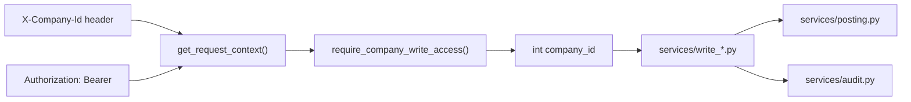

# FASTAPI-REACT-02 — API Write Hardening (Explicit `company_id`)

**Mode:** Verification + contract closure. **No accounting behavior change.**

**Date:** 2026-06-05  
**Authority:** Implements slice **FASTAPI-REACT-02** from [FASTAPI_REACT_01_POSTING_BOUNDARY_AUDIT](./FASTAPI_REACT_01_POSTING_BOUNDARY_AUDIT.md) §7.  
**Tag:** `fastapi-react-02-api-write-hardening`  
**Prerequisite audits:** [P2_HARDEN_01_AUDIT_CLOSURE](./P2_HARDEN_01_AUDIT_CLOSURE.md) · [FASTAPI_REACT_01_POSTING_BOUNDARY_AUDIT](./FASTAPI_REACT_01_POSTING_BOUNDARY_AUDIT.md)

---

## 1. Executive summary

| Item | Status |
|------|--------|
| Explicit `company_id` on API writes | ✅ **Closed** — `X-Company-Id` → guard → `write_*` → `posting`/`audit` |
| Streamlit ambient fallback on API path | ✅ **Absent** — API never calls `app._current_company_id()` |
| Service-layer stamping | ✅ **Closed** — P2-HARDEN-01 H-01 matrix |
| Boundary commit at API | 🟡 **Ready, not flipped** — `write_*` honors `commit_modes`; default `internal` |
| Kernel DTO cleanup | 🟡 **Partial** — route Pydantic/dataclasses; kernels still return ORM (TD-PS-03) |
| React bootstrap | ⬜ Not started (out of scope) |
| New API routes | ⬜ Not added (out of scope) |

**Posting / GL behavior:** **UNCHANGED** — this slice formalizes existing P2 write contracts.

---

## 2. Characterization — `company_id` flow



| Layer | File | Responsibility |
|-------|------|----------------|
| Session | `api/dependencies.py` → `get_db()` | Bare `SessionLocal` — **no** `before_flush` stamp hook |
| Context | `api/dependencies.py` → `get_request_context()` | JWT + `X-Company-Id` → `RequestContext` |
| Guard | `api/guards.py` | `require_company_write_access` → membership + permission + `int` tenant |
| Write services | `services/write_*.py` | Explicit `company_id: int` on all entrypoints |
| Posting kernel | `services/posting.py` | Receives explicit `company_id`; no ambient API fallback |

**HTTP contract:** 401 bearer · 400 missing company (`active_company_id`) · 403 membership/permission · 422 body `company_id` rejected.

**Core invariants** (from [fastapi_p2_write_api_inventory](./fastapi_p2_write_api_inventory.md)):

- No GET commits
- JWT RequestContext
- X-Company-Id
- Never trust company_id from request body
- Never delete accounting records
- Void → reverse → audit

---

## 3. Write endpoint inventory (13 accounting POSTs)

Frozen in `registry/api_write_contract.py` → `API_WRITE_ENDPOINTS`.

| Route file | Handler | Permission | Service |
|------------|---------|------------|---------|
| `sales.py` | `post_sale` | `create_transaction` | `write_sales.create_and_post_sale` |
| `expenses.py` | `post_expense` | `create_transaction` | `write_expenses.create_and_post_expense` |
| `purchases.py` | `post_purchase` | `create_transaction` | `write_purchases.create_and_post_purchase` |
| `receivable_payments.py` | `post_receivable_payment` | `create_transaction` | `write_receivable_payments.record_receivable_payment` |
| `voids.py` | `post_void` | `void_transaction` | `write_voids.void_record` |
| `partner_movements.py` | `post_partner_movement` | `post_partner_movement` | `write_partner_worker.post_partner_movement_record` |
| `worker_payments.py` | `post_worker_payment` | `post_worker_movement` | `write_partner_worker.post_worker_payment_record` |
| `bank_transactions.py` | `post_bank_transaction` | `manage_banking` | `write_banking.create_manual_bank_transaction` |
| `reconciliation.py` | `post_reconciliation_match` | `import_bank_statement` | `write_reconciliation.match_statement_row` |
| `reconciliation.py` | `post_reconciliation_unmatch` | `import_bank_statement` | `write_reconciliation.unmatch_statement_row` |
| `closing.py` | `post_close_period` | `close_fiscal_period` | `write_closing.close_period` |
| `closing.py` | `post_profit_allocation` | `allocate_profit` | `write_closing.allocate` |
| `closing.py` | `post_void_allocation` | `void_profit_allocation` | `write_closing.void_allocation` |

Every handler pattern:

1. `Depends(get_request_context)`
2. `company_id = require_company_write_access(session, context, "<permission>")`
3. `write_*.(..., company_id=company_id, ...)`

---

## 4. P2-HARDEN-01 cross-reference (stamping closed)

| Slice | Status | Evidence |
|-------|--------|----------|
| **H-01** Company stamp matrix | ✅ | `tests/test_p2_harden_01_company_stamp_matrix.py` |
| **H-02** P2 fixture fidelity | ✅ | No `before_flush` in `test_fastapi_p2_*.py` |
| **H-03** Systemic API auto-stamp | ⏸️ Rejected | Explicit stamping remains standard |

Standing rules (locked):

1. Explicit `company_id` on ORM constructors and `posting.create_journal_entry(..., company_id=...)`.
2. No silent `before_flush` on API sessions.
3. Streamlit `_stamp_company_id_on_new_objects` stays Streamlit-only.
4. Wrapper post-stamps for kernel NULL gaps (`write_partner_worker`, `write_closing.allocate`).

---

## 5. TD-PS-06/07 resolution on API path

| ID | API status | Streamlit (unchanged) |
|----|------------|----------------------|
| **TD-PS-06** | ✅ Closed — write services pass explicit `company_id` to resolvers | `calculate_account_balance*` still in `app.py` |
| **TD-PS-07** | ✅ Closed — no ambient fallback in `write_*` or API routes | Shims use `resolve_company_id_for_posting` + `_current_company_id()` |

---

## 6. Documented gaps (deferred)

| ID | Gap | Next slice |
|----|-----|------------|
| **TD-PS-01** | Default `internal` commits; `COMMIT_MODE_*=boundary` not production-flipped | FASTAPI-REACT-03 or dedicated commit rollout |
| **TD-PS-03** | Kernel ORM returns; route-layer DTOs only | FASTAPI-REACT-04+ serialization |
| **TD-POSTING-06** | `reconciliation/match_post.py` lazy `import app` | FASTAPI-REACT-03 |

---

## 7. What must NOT change (verified)

- Journal debit/credit math and GL pairs
- Void cascades and audit semantics
- Default commit mode (`internal`)
- Feature-flag gating (`ERP_API_WRITE_*`)
- Docker / React / new routes

---

## 8. Test plan

```bash
pytest tests/test_fastapi_react_02_api_write_hardening.py \
  tests/test_p2_harden_01_company_stamp_matrix.py \
  tests/test_fastapi_p2_*.py -q

pytest tests/ -q
```

---

## 9. Recommendation / next slice

**FASTAPI-REACT-03** — reconciliation `_app()` removal + TD-PS-01 boundary commit rollout behind dual-run tests. **Defer React** until FR-03 commit parity is characterized on PostgreSQL test runtime.
